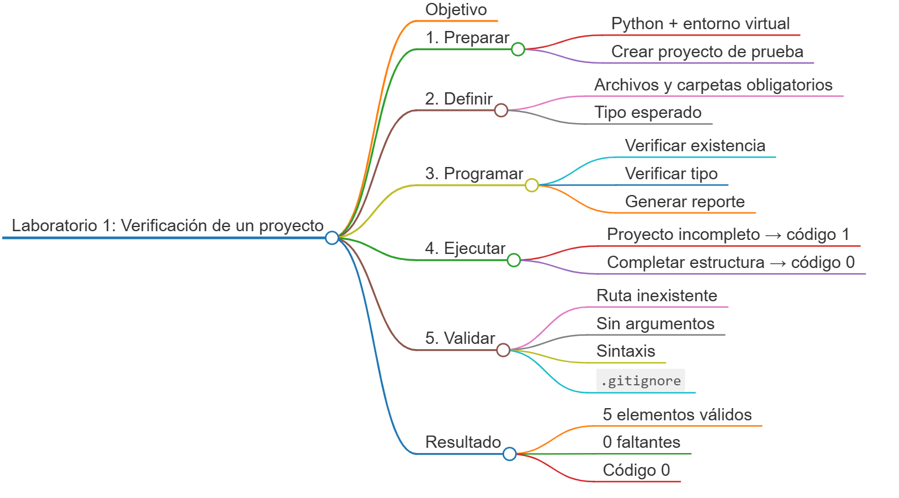
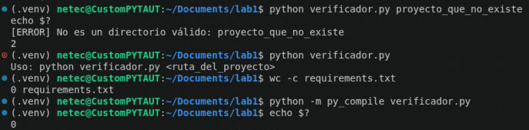

# Laboratorio 1: Verificación de la estructura de un proyecto

## Objetivo de la práctica:

Preparar un entorno profesional de Python y desarrollar un script que inspeccione un proyecto, compruebe la existencia de carpetas y archivos obligatorios, y reporte de forma clara cuáles elementos existen, cuáles faltan y si cada elemento encontrado tiene el tipo esperado.

## Objetivo Visual:



## Duración aproximada:

- 30 minutos.

## Instrucciones

### Tarea 1. **Preparación del entorno y proyecto**

Paso 1. En Ubuntu, instale los requisitos del sistema; abra **Visual Studio Code**; seleccione **File -> Open Folder**; cree la carpeta `laboratorio_1` y ábrala.

```bash
sudo apt update
sudo apt install -y python3 python3-venv python3-pip
```

Paso 2. Desde VS Code seleccione **Terminal -> New Terminal** y verifique la instalación:

```bash
python3 --version
```

Paso 3. Cree y active un entorno virtual:

```bash
python3 -m venv .venv
source .venv/bin/activate
```

Paso 4. Presione `Ctrl + Shift + P`, ejecute `Python: Select Interpreter` y seleccione `.venv/bin/python`.

Paso 5. Cree la estructura inicial y los datos de prueba:

```bash
mkdir -p proyecto_ejemplo/data proyecto_ejemplo/logs
printf '# Proyecto de ejemplo\n' > proyecto_ejemplo/README.md
touch verificador.py requirements.txt
```

Paso 6. Confirme el estado inicial. `output/` y `proyecto_ejemplo/requirements.txt` no deben existir todavía:

```bash
find proyecto_ejemplo -maxdepth 2 -print | sort
```

### Tarea 2. **Definición de los elementos obligatorios**

Paso 7. Abra `verificador.py` y agregue las importaciones y la constante que representa el contrato del proyecto:

```python
import sys
from pathlib import Path


ELEMENTOS_OBLIGATORIOS = {
    "data": "directorio",
    "logs": "directorio",
    "output": "directorio",
    "requirements.txt": "archivo",
    "README.md": "archivo",
}
```

Paso 8. Agregue una función que compruebe tanto la existencia como el tipo de cada ruta:

```python
def verificar_elemento(ruta: Path, tipo_esperado: str) -> tuple[bool, str]:
    """Comprueba que una ruta exista y coincida con el tipo esperado."""
    if not ruta.exists():
        return False, "no existe"

    if tipo_esperado == "directorio" and not ruta.is_dir():
        return False, "existe, pero no es un directorio"

    if tipo_esperado == "archivo" and not ruta.is_file():
        return False, "existe, pero no es un archivo"

    return True, "correcto"
```

Paso 9. Agregue la función que recorra todos los requisitos y construya un resultado reutilizable:

```python
def auditar_proyecto(ruta_proyecto: Path) -> list[dict]:
    """Retorna el diagnóstico de cada elemento obligatorio."""
    resultados = []

    for nombre, tipo in ELEMENTOS_OBLIGATORIOS.items():
        valido, detalle = verificar_elemento(ruta_proyecto / nombre, tipo)
        resultados.append(
            {
                "elemento": nombre,
                "tipo": tipo,
                "valido": valido,
                "detalle": detalle,
            }
        )

    return resultados
```

### Tarea 3. **Presentación del reporte**

Paso 10. Agregue una función para mostrar un resumen legible:

```python
def mostrar_reporte(ruta_proyecto: Path, resultados: list[dict]) -> None:
    """Imprime el resultado de la auditoría en la consola."""
    print("=" * 60)
    print(f"VERIFICACIÓN: {ruta_proyecto.resolve()}")
    print("=" * 60)

    for resultado in resultados:
        estado = "OK" if resultado["valido"] else "FALTA"
        print(
            f"[{estado:5}] {resultado['elemento']:<20} "
            f"({resultado['tipo']}): {resultado['detalle']}"
        )

    existentes = sum(item["valido"] for item in resultados)
    faltantes = len(resultados) - existentes
    print("-" * 60)
    print(f"Existentes y válidos: {existentes}")
    print(f"Faltantes o incorrectos: {faltantes}")
```

Paso 11. Agregue la función principal con validación de argumentos:

```python
def main() -> int:
    if len(sys.argv) != 2:
        print("Uso: python verificador.py <ruta_del_proyecto>")
        return 2

    ruta_proyecto = Path(sys.argv[1])

    if not ruta_proyecto.is_dir():
        print(f"[ERROR] No es un directorio válido: {ruta_proyecto}")
        return 2

    resultados = auditar_proyecto(ruta_proyecto)
    mostrar_reporte(ruta_proyecto, resultados)
    return 0 if all(item["valido"] for item in resultados) else 1


if __name__ == "__main__":
    raise SystemExit(main())
```

### Tarea 4. **Ejecución y validaciones**

Paso 12. Ejecute la auditoría sobre la estructura incompleta:

```bash
python verificador.py proyecto_ejemplo
```

Paso 13. Verifique el código de salida. Debe ser `1` porque faltan elementos:

```bash
echo $?
```

Paso 14. Cree los dos elementos que faltan y repita la auditoría:

```bash
mkdir proyecto_ejemplo/output
touch proyecto_ejemplo/requirements.txt
python verificador.py proyecto_ejemplo
echo $?
```

Paso 15. Confirme que ahora todos los elementos aparezcan como `[OK]` y que el código de salida sea `0`.

Paso 16. Pruebe el manejo de una ruta inexistente:

```bash
python verificador.py proyecto_que_no_existe
echo $?
```

Paso 17. Pruebe una ejecución sin argumento y confirme que se muestre el texto de uso:

```bash
python verificador.py
```

### Tarea 5. **Validación del entorno reproducible**

Paso 18. Debido a que el script utiliza únicamente la biblioteca estándar, deje el `requirements.txt` del laboratorio vacío y compruébelo:

```bash
wc -c requirements.txt
```

Paso 19. Cree un archivo `.gitignore` para no versionar el entorno virtual ni archivos temporales:

```text
.venv/
__pycache__/
*.pyc
```

Paso 20. Ejecute una comprobación final de sintaxis:

```bash
python -m py_compile verificador.py
```

### Resultado esperado

La primera ejecución debe marcar `output` y `requirements.txt` como faltantes y terminar con código `1`. Después de crearlos, el reporte debe mostrar cinco elementos válidos, cero faltantes y código de salida `0`. El script también debe rechazar rutas inválidas y ejecuciones sin argumento con un mensaje comprensible.




