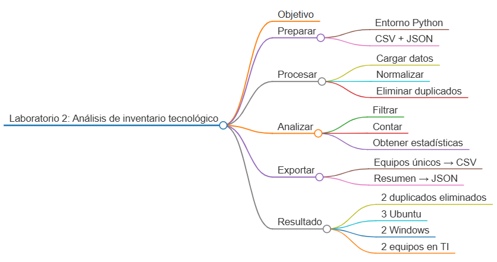
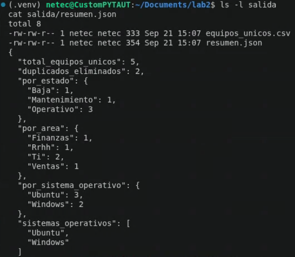

# Laboratorio 2: Consolidación y análisis de inventario tecnológico

## Objetivo de la práctica:

Desarrollar un programa en Python que cargue registros de equipos desde archivos CSV y JSON, normalice sus datos, elimine duplicados, permita filtrar por estado, área o sistema operativo y genere estadísticas básicas mediante listas, diccionarios, sets y comprehensions.

## Objetivo Visual:



## Duración aproximada:

- 45 minutos.

## Instrucciones

### Tarea 1. **Preparación del entorno y archivos de entrada**

Paso 1. En Ubuntu, abra **Visual Studio Code**, cree la carpeta `laboratorio_2` y ábrala con **File -> Open Folder**.

Paso 2. Desde **Terminal -> New Terminal**, prepare el entorno:

```bash
sudo apt update
sudo apt install -y python3 python3-venv python3-pip
python3 -m venv .venv
source .venv/bin/activate
mkdir -p datos salida
touch main.py requirements.txt
```

Paso 3. Seleccione `.venv/bin/python` mediante `Ctrl + Shift + P` y `Python: Select Interpreter`.

Paso 4. Cree `datos/equipos.csv` con codificación UTF-8:

```csv
id,nombre,tipo,estado,area,sistema_operativo
EQ-001,Portátil Finanzas,Laptop,Operativo,Finanzas,Ubuntu
EQ-002,Servidor Aplicaciones,Servidor,Mantenimiento,TI,Ubuntu
EQ-003,Equipo Nómina,Desktop,Operativo,RRHH,Windows
EQ-001,Portátil Finanzas,Laptop,Operativo,Finanzas,Ubuntu
```

Paso 5. Cree `datos/equipos.json`:

```json
[
  {
    "id": "EQ-004",
    "nombre": "Portátil Comercial",
    "tipo": "Laptop",
    "estado": "operativo",
    "area": "Ventas",
    "sistema_operativo": "Windows"
  },
  {
    "id": "EQ-005",
    "nombre": "Servidor de Datos",
    "tipo": "Servidor",
    "estado": "BAJA",
    "area": "TI",
    "sistema_operativo": "Ubuntu"
  },
  {
    "id": "EQ-002",
    "nombre": "Servidor Aplicaciones",
    "tipo": "Servidor",
    "estado": "Mantenimiento",
    "area": "TI",
    "sistema_operativo": "Ubuntu"
  }
]
```

### Tarea 2. **Carga y normalización de registros**

Paso 6. Abra `main.py` y agregue las importaciones y rutas:

```python
import csv
import json
from collections import Counter
from pathlib import Path


BASE_DIR = Path(__file__).resolve().parent
DATOS_DIR = BASE_DIR / "datos"
SALIDA_DIR = BASE_DIR / "salida"
CAMPOS = ["id", "nombre", "tipo", "estado", "area", "sistema_operativo"]
```

Paso 7. Agregue la función de normalización. Los espacios se eliminan y los campos de clasificación se convierten a formato consistente:

```python
def normalizar_registro(registro: dict) -> dict:
    normalizado = {
        campo: str(registro.get(campo, "")).strip() for campo in CAMPOS
    }
    normalizado["id"] = normalizado["id"].upper()
    normalizado["tipo"] = normalizado["tipo"].title()
    normalizado["estado"] = normalizado["estado"].title()
    normalizado["area"] = normalizado["area"].title()
    normalizado["sistema_operativo"] = normalizado["sistema_operativo"].title()
    return normalizado
```

Paso 8. Agregue la carga de CSV:

```python
def cargar_csv(ruta: Path) -> list[dict]:
    with ruta.open("r", encoding="utf-8", newline="") as archivo:
        return [normalizar_registro(fila) for fila in csv.DictReader(archivo)]
```

Paso 9. Agregue la carga de JSON y valide que la raíz sea una lista:

```python
def cargar_json(ruta: Path) -> list[dict]:
    with ruta.open("r", encoding="utf-8") as archivo:
        datos = json.load(archivo)

    if not isinstance(datos, list):
        raise ValueError("El JSON debe contener una lista de equipos.")

    return [normalizar_registro(registro) for registro in datos]
```

### Tarea 3. **Deduplicación, filtros y estadísticas**

Paso 10. Agregue una función que elimine duplicados por `id`. El diccionario conserva un único registro por identificador:

```python
def eliminar_duplicados(registros: list[dict]) -> tuple[list[dict], int]:
    por_id = {}

    for registro in registros:
        identificador = registro["id"]
        if identificador:
            por_id[identificador] = registro

    duplicados = len(registros) - len(por_id)
    return list(por_id.values()), duplicados
```

Paso 11. Agregue un filtro reutilizable:

```python
def filtrar(registros: list[dict], campo: str, valor: str) -> list[dict]:
    valor_normalizado = valor.strip().casefold()
    return [
        registro
        for registro in registros
        if registro.get(campo, "").casefold() == valor_normalizado
    ]
```

Paso 12. Agregue una función para contar valores de una columna:

```python
def contar_por(registros: list[dict], campo: str) -> dict:
    conteo = Counter(registro.get(campo) or "Sin dato" for registro in registros)
    return dict(sorted(conteo.items()))
```

Paso 13. Construya las estadísticas. Observe el uso de un `set` para obtener sistemas operativos únicos:

```python
def generar_estadisticas(registros: list[dict], duplicados: int) -> dict:
    sistemas = sorted(
        {registro["sistema_operativo"] for registro in registros if registro["sistema_operativo"]}
    )
    return {
        "total_equipos_unicos": len(registros),
        "duplicados_eliminados": duplicados,
        "por_estado": contar_por(registros, "estado"),
        "por_area": contar_por(registros, "area"),
        "por_sistema_operativo": contar_por(registros, "sistema_operativo"),
        "sistemas_operativos": sistemas,
    }
```

### Tarea 4. **Exportación de resultados**

Paso 14. Agregue la exportación CSV:

```python
def guardar_csv(ruta: Path, registros: list[dict]) -> None:
    with ruta.open("w", encoding="utf-8", newline="") as archivo:
        escritor = csv.DictWriter(archivo, fieldnames=CAMPOS)
        escritor.writeheader()
        escritor.writerows(registros)
```

Paso 15. Agregue la exportación JSON:

```python
def guardar_json(ruta: Path, datos: dict) -> None:
    with ruta.open("w", encoding="utf-8") as archivo:
        json.dump(datos, archivo, indent=2, ensure_ascii=False)
```

Paso 16. Agregue la ejecución principal:

```python
def main() -> None:
    SALIDA_DIR.mkdir(exist_ok=True)

    registros = cargar_csv(DATOS_DIR / "equipos.csv")
    registros.extend(cargar_json(DATOS_DIR / "equipos.json"))
    equipos_unicos, duplicados = eliminar_duplicados(registros)
    estadisticas = generar_estadisticas(equipos_unicos, duplicados)

    guardar_csv(SALIDA_DIR / "equipos_unicos.csv", equipos_unicos)
    guardar_json(SALIDA_DIR / "resumen.json", estadisticas)

    print(json.dumps(estadisticas, indent=2, ensure_ascii=False))
    print("\nEquipos de TI:")
    for equipo in filtrar(equipos_unicos, "area", "TI"):
        print(f"- {equipo['id']}: {equipo['nombre']} ({equipo['estado']})")


if __name__ == "__main__":
    main()
```

### Tarea 5. **Ejecución y validaciones**

Paso 17. Ejecute el programa:

```bash
python main.py
```

Paso 18. Verifique que existan los dos archivos de salida:

```bash
ls -l salida
cat salida/resumen.json
```

Paso 19. Confirme los resultados principales:

- Cinco equipos únicos.
- Dos registros duplicados eliminados.
- Tres equipos con Ubuntu y dos con Windows.
- Dos equipos pertenecientes al área de TI.


### Resultado esperado

