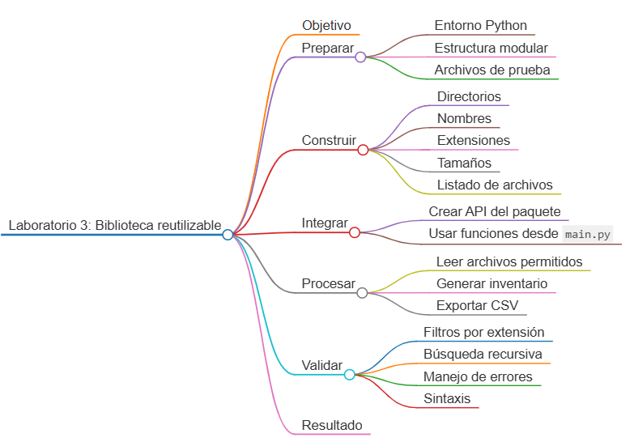
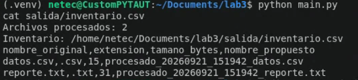

# Laboratorio 3: Biblioteca reutilizable para procesamiento de archivos

## Objetivo de la práctica:

Construir un paquete de funciones reutilizables para crear directorios, listar archivos, validar extensiones, calcular tamaños y generar nombres nuevos; posteriormente, utilizarlo desde un script principal que procese una carpeta y produzca un inventario.

## Objetivo Visual:



## Duración aproximada:

- 60 minutos.


## Instrucciones

### Tarea 1. **Preparación del entorno y estructura modular**

Paso 1. En Ubuntu, abra **Visual Studio Code**, cree `laboratorio_3` y ábralo con **File -> Open Folder**.

Paso 2. Prepare el entorno desde la terminal integrada:

```bash
sudo apt update
sudo apt install -y python3 python3-venv python3-pip
python3 -m venv .venv
source .venv/bin/activate
mkdir -p utilidades entrada salida
touch main.py requirements.txt
touch utilidades/__init__.py utilidades/archivos.py
touch utilidades/nombres.py utilidades/directorios.py
```

Paso 3. Seleccione el intérprete `.venv/bin/python` desde `Python: Select Interpreter`.

Paso 4. Cree los archivos de prueba:

```bash
printf 'Reporte mensual de operaciones\n' > entrada/reporte.txt
printf 'id,valor\n1,125\n' > entrada/datos.csv
printf '2026-01-15 INFO Aplicación iniciada\n' > entrada/aplicacion.log
```

### Tarea 2. **Módulo de directorios**

Paso 5. Abra `utilidades/directorios.py` y agregue:

```python
from pathlib import Path


def crear_directorio(ruta: Path) -> Path:
    """Crea un directorio y sus padres si no existen."""
    ruta.mkdir(parents=True, exist_ok=True)
    return ruta
```

### Tarea 3. **Módulo de nombres**

Paso 6. Abra `utilidades/nombres.py` y agregue una función con type hints, docstring, parámetro predeterminado y validación de entrada:

```python
from datetime import datetime
from pathlib import Path


def generar_nombre(
    archivo: Path,
    prefijo: str = "procesado",
    fecha: datetime | None = None,
) -> str:
    """Genera un nombre que conserva el sufijo del archivo original."""
    if not archivo.name:
        raise ValueError("La ruta debe incluir el nombre de un archivo.")

    momento = fecha or datetime.now()
    marca = momento.strftime("%Y%m%d_%H%M%S")
    return f"{prefijo}_{marca}_{archivo.stem}{archivo.suffix.lower()}"
```

Paso 7. Pruebe un resultado determinista:

```bash
python -c "from datetime import datetime; from pathlib import Path; from utilidades.nombres import generar_nombre; print(generar_nombre(Path('datos.CSV'), fecha=datetime(2026, 1, 15, 10, 30)))"
```

### Tarea 4. **Módulo de archivos**

Paso 8. Abra `utilidades/archivos.py` y agregue la función de validación:

```python
from pathlib import Path


def validar_extension(archivo: Path, extensiones: tuple[str, ...]) -> bool:
    """Indica si el sufijo del archivo está permitido."""
    permitidas = {extension.lower() for extension in extensiones}
    return archivo.is_file() and archivo.suffix.lower() in permitidas
```

Paso 9. Agregue una función para listar archivos de forma no recursiva o recursiva:

```python
def listar_archivos(
    directorio: Path,
    extensiones: tuple[str, ...] = (),
    recursivo: bool = False,
) -> list[Path]:
    """Lista archivos ordenados y permite filtrarlos por extensión."""
    if not directorio.is_dir():
        raise NotADirectoryError(f"Directorio no válido: {directorio}")

    candidatos = directorio.rglob("*") if recursivo else directorio.iterdir()
    archivos = [ruta for ruta in candidatos if ruta.is_file()]

    if extensiones:
        archivos = [
            ruta for ruta in archivos if validar_extension(ruta, extensiones)
        ]

    return sorted(archivos, key=lambda ruta: str(ruta).casefold())
```

Paso 10. Agregue el cálculo de tamaños:

```python
def calcular_tamano(archivo: Path) -> int:
    """Retorna el tamaño de un archivo en bytes."""
    if not archivo.is_file():
        raise FileNotFoundError(f"Archivo no encontrado: {archivo}")
    return archivo.stat().st_size
```

### Tarea 5. **Definición de la API pública del paquete**

Paso 11. Abra `utilidades/__init__.py` y exponga solamente las funciones públicas:

```python
from .archivos import calcular_tamano, listar_archivos, validar_extension
from .directorios import crear_directorio
from .nombres import generar_nombre


__all__ = [
    "calcular_tamano",
    "crear_directorio",
    "generar_nombre",
    "listar_archivos",
    "validar_extension",
]
```

Paso 12. Compruebe que importar el paquete no ejecute código adicional:

```bash
python -c "import utilidades; print(utilidades.__all__)"
```

### Tarea 6. **Script principal e inventario**

Paso 13. Abra `main.py` y agregue:

```python
import csv
from pathlib import Path

from utilidades import calcular_tamano, crear_directorio, generar_nombre, listar_archivos


BASE_DIR = Path(__file__).resolve().parent
ENTRADA = BASE_DIR / "entrada"
SALIDA = BASE_DIR / "salida"
EXTENSIONES = (".txt", ".csv")
```

Paso 14. Agregue la construcción de registros del inventario:

```python
def construir_inventario(archivos: list[Path]) -> list[dict]:
    return [
        {
            "nombre_original": archivo.name,
            "extension": archivo.suffix.lower(),
            "tamano_bytes": calcular_tamano(archivo),
            "nombre_propuesto": generar_nombre(archivo),
        }
        for archivo in archivos
    ]
```

Paso 15. Agregue la escritura del CSV:

```python
def guardar_inventario(ruta: Path, registros: list[dict]) -> None:
    campos = ["nombre_original", "extension", "tamano_bytes", "nombre_propuesto"]
    with ruta.open("w", encoding="utf-8", newline="") as archivo:
        escritor = csv.DictWriter(archivo, fieldnames=campos)
        escritor.writeheader()
        escritor.writerows(registros)
```

Paso 16. Agregue el punto de entrada:

```python
def main() -> None:
    crear_directorio(SALIDA)
    archivos = listar_archivos(ENTRADA, EXTENSIONES)
    registros = construir_inventario(archivos)
    ruta_inventario = SALIDA / "inventario.csv"
    guardar_inventario(ruta_inventario, registros)

    print(f"Archivos procesados: {len(registros)}")
    print(f"Inventario: {ruta_inventario}")


if __name__ == "__main__":
    main()
```

### Tarea 7. **Ejecución y validaciones**

Paso 17. Ejecute el programa:

```bash
python main.py
cat salida/inventario.csv
```

Paso 18. Confirme que se procesen solamente `reporte.txt` y `datos.csv`; `aplicacion.log` debe quedar fuera por su extensión.

Paso 19. Cree una subcarpeta y un archivo adicional:

```bash
mkdir -p entrada/historico
printf 'id,valor\n2,250\n' > entrada/historico/enero.csv
```

Paso 20. Cambie en `main.py` la llamada por `listar_archivos(ENTRADA, EXTENSIONES, recursivo=True)`, ejecute nuevamente y confirme que ahora se procesen tres archivos.

Paso 21. Compruebe el manejo de una ruta inválida:

```bash
python -c "from pathlib import Path; from utilidades import listar_archivos; listar_archivos(Path('no_existe'))"
```

Paso 22. Valide todos los módulos:

```bash
python -m compileall -q main.py utilidades
```

Paso 23. Este proyecto solo usa la biblioteca estándar; mantenga `requirements.txt` vacío.

### Resultado esperado


