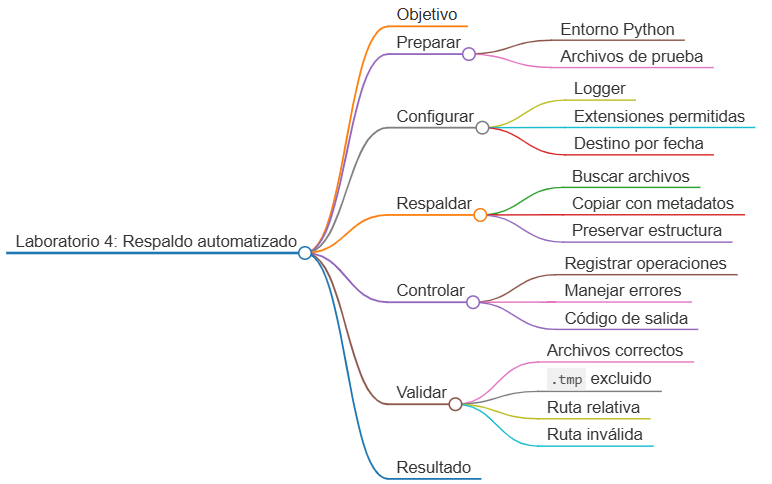
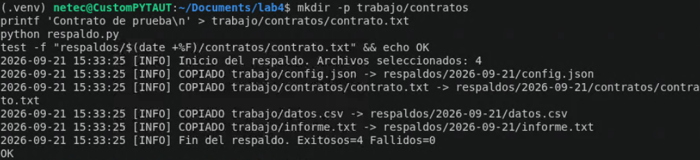

# Laboratorio 4: Respaldo automatizado con trazabilidad

## Objetivo de la práctica:

Desarrollar una solución en Python que copie archivos importantes desde una carpeta de trabajo hacia una estructura de respaldo organizada por fecha, preserve metadatos, controle errores por archivo y registre cada operación en un log rotativo.

## Objetivo Visual:



## Duración aproximada:

- 45 minutos.


## Instrucciones

### Tarea 1. **Preparación del entorno y datos de prueba**

Paso 1. En Ubuntu, abra **Visual Studio Code**, cree `laboratorio_4` y ábralo con **File -> Open Folder**.

Paso 2. Prepare el entorno desde la terminal integrada:

```bash
sudo apt update
sudo apt install -y python3 python3-venv python3-pip
python3 -m venv .venv
source .venv/bin/activate
mkdir -p trabajo logs respaldos
touch respaldo.py requirements.txt
```

Paso 3. Seleccione `.venv/bin/python` mediante `Python: Select Interpreter`.

Paso 4. Cree los archivos de entrada:

```bash
printf 'Informe operativo\nEstado: aprobado\n' > trabajo/informe.txt
printf '{"ambiente": "pruebas", "reintentos": 3}\n' > trabajo/config.json
printf 'id,valor\n1,125\n2,250\n' > trabajo/datos.csv
printf 'No respaldar\n' > trabajo/temporal.tmp
```

### Tarea 2. **Configuración del registro de actividad**

Paso 5. Abra `respaldo.py` y agregue las importaciones:

```python
import argparse
import logging
import shutil
from datetime import date
from logging.handlers import RotatingFileHandler
from pathlib import Path
```

Paso 6. Agregue una función que configure consola y archivo sin duplicar handlers:

```python
def configurar_logger(ruta_log: Path) -> logging.Logger:
    ruta_log.parent.mkdir(parents=True, exist_ok=True)
    logger = logging.getLogger("respaldo")
    logger.setLevel(logging.DEBUG)

    if logger.handlers:
        return logger

    formato = logging.Formatter(
        "%(asctime)s [%(levelname)s] %(message)s",
        datefmt="%Y-%m-%d %H:%M:%S",
    )

    consola = logging.StreamHandler()
    consola.setLevel(logging.INFO)
    consola.setFormatter(formato)

    archivo = RotatingFileHandler(
        ruta_log,
        maxBytes=1_000_000,
        backupCount=3,
        encoding="utf-8",
    )
    archivo.setLevel(logging.DEBUG)
    archivo.setFormatter(formato)

    logger.addHandler(consola)
    logger.addHandler(archivo)
    return logger
```

### Tarea 3. **Selección y copia segura de archivos**

Paso 7. Defina las extensiones que se consideran importantes:

```python
EXTENSIONES_PERMITIDAS = {".txt", ".json", ".csv"}
```

Paso 8. Agregue una función para descubrir archivos:

```python
def obtener_archivos(origen: Path) -> list[Path]:
    if not origen.is_dir():
        raise NotADirectoryError(f"La carpeta de origen no existe: {origen}")

    return sorted(
        archivo
        for archivo in origen.rglob("*")
        if archivo.is_file() and archivo.suffix.lower() in EXTENSIONES_PERMITIDAS
    )
```

Paso 9. Agregue la copia de un archivo. `copy2` conserva, cuando el sistema lo permite, la fecha de modificación y otros metadatos:

```python
def copiar_archivo(
    archivo: Path,
    origen: Path,
    destino_fecha: Path,
    logger: logging.Logger,
) -> bool:
    try:
        ruta_relativa = archivo.relative_to(origen)
        destino = destino_fecha / ruta_relativa
        destino.parent.mkdir(parents=True, exist_ok=True)
        shutil.copy2(archivo, destino)

        if archivo.stat().st_size != destino.stat().st_size:
            raise OSError("El tamaño del archivo copiado no coincide con el original.")

        logger.info("COPIADO %s -> %s", archivo, destino)
        return True
    except (OSError, ValueError) as error:
        logger.exception("FALLO al copiar %s: %s", archivo, error)
        return False
```

### Tarea 4. **Orquestación y manejo de errores**

Paso 10. Agregue la función que crea la carpeta con la fecha del día y procesa cada archivo de manera independiente:

```python
def ejecutar_respaldo(
    origen: Path,
    destino_base: Path,
    logger: logging.Logger,
) -> tuple[int, int]:
    archivos = obtener_archivos(origen)
    destino_fecha = destino_base / date.today().isoformat()
    destino_fecha.mkdir(parents=True, exist_ok=True)

    exitosos = 0
    fallidos = 0

    logger.info("Inicio del respaldo. Archivos seleccionados: %d", len(archivos))
    for archivo in archivos:
        if copiar_archivo(archivo, origen, destino_fecha, logger):
            exitosos += 1
        else:
            fallidos += 1

    logger.info("Fin del respaldo. Exitosos=%d Fallidos=%d", exitosos, fallidos)
    return exitosos, fallidos
```

Paso 11. Agregue los argumentos de línea de comandos:

```python
def crear_parser() -> argparse.ArgumentParser:
    parser = argparse.ArgumentParser(
        description="Respalda archivos importantes en una carpeta organizada por fecha."
    )
    parser.add_argument("--origen", type=Path, default=Path("trabajo"))
    parser.add_argument("--destino", type=Path, default=Path("respaldos"))
    parser.add_argument("--log", type=Path, default=Path("logs/respaldo.log"))
    return parser
```

Paso 12. Agregue el punto de entrada y capture los errores de configuración:

```python
def main() -> int:
    argumentos = crear_parser().parse_args()
    logger = configurar_logger(argumentos.log)

    try:
        _, fallidos = ejecutar_respaldo(
            argumentos.origen,
            argumentos.destino,
            logger,
        )
    except (NotADirectoryError, PermissionError, OSError) as error:
        logger.exception("No fue posible iniciar el respaldo: %s", error)
        return 1

    return 1 if fallidos else 0


if __name__ == "__main__":
    raise SystemExit(main())
```

### Tarea 5. **Ejecución y validaciones**

Paso 13. Ejecute el respaldo:

```bash
python respaldo.py
```

Paso 14. Revise los archivos copiados. La sustitución `$(date +%F)` produce la fecha actual en Ubuntu:

```bash
find "respaldos/$(date +%F)" -type f -print | sort
```

Paso 15. Confirme que `informe.txt`, `config.json` y `datos.csv` estén presentes, y que `temporal.tmp` no se haya copiado.

Paso 16. Revise la trazabilidad:

```bash
cat logs/respaldo.log
```

Paso 17. Ejecute el programa por segunda vez. Debe ser idempotente para la misma fecha: actualizará las copias sin crear nombres duplicados.

Paso 18. Pruebe una ruta inexistente y compruebe que el proceso termine con código distinto de cero:

```bash
python respaldo.py --origen no_existe
echo $?
```

Paso 19. Cree una subcarpeta y confirme que se preserve su ruta relativa:

```bash
mkdir -p trabajo/contratos
printf 'Contrato de prueba\n' > trabajo/contratos/contrato.txt
python respaldo.py
test -f "respaldos/$(date +%F)/contratos/contrato.txt" && echo OK
```

### Resultado esperado

