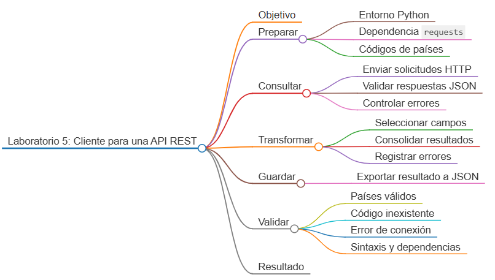
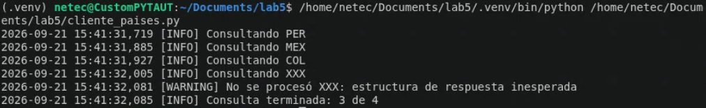

# Laboratorio 5: Cliente para consulta de países mediante una API REST

## Objetivo de la práctica:

Desarrollar un cliente en Python que lea una lista de códigos de país, consulte la API pública del Banco Mundial mediante HTTP, valide las respuestas JSON, seleccione solamente los campos relevantes y almacene un resultado consolidado con manejo de errores.

## Objetivo Visual:



## Duración aproximada:

- 45 minutos.


## Instrucciones

### Tarea 1. **Preparación del entorno y proyecto**

Paso 1. En Ubuntu, abra **Visual Studio Code**, cree `laboratorio_5` y ábralo con **File -> Open Folder**.

Paso 2. Prepare el entorno:

```bash
sudo apt update
sudo apt install -y python3 python3-venv python3-pip curl
python3 -m venv .venv
source .venv/bin/activate
mkdir -p datos salida
touch cliente_paises.py requirements.txt
```

Paso 3. Seleccione `.venv/bin/python` en `Python: Select Interpreter`.

Paso 4. Agregue la dependencia gratuita al archivo `requirements.txt`:

```text
requests>=2.31,<3
```

Paso 5. Instale la dependencia:

```bash
python -m pip install -r requirements.txt
```

Paso 6. Cree `datos/paises.json`:

```json
[
  "PER",
  "MEX",
  "COL",
  "XXX"
]
```

### Tarea 2. **Exploración del servicio HTTP**

Paso 7. Realice una consulta manual y observe el código HTTP, encabezados y cuerpo JSON:

```bash
curl -i "https://api.worldbank.org/v2/country/PER?format=json"
```

Paso 8. Identifique la estructura: la respuesta válida es una lista cuyo primer elemento contiene metadatos y cuyo segundo elemento contiene los registros.

### Tarea 3. **Carga de configuración y cliente HTTP**

Paso 9. Abra `cliente_paises.py` y agregue:

```python
import json
import logging
from pathlib import Path

import requests


BASE_DIR = Path(__file__).resolve().parent
URL_BASE = "https://api.worldbank.org/v2/country"
logging.basicConfig(
    level=logging.INFO,
    format="%(asctime)s [%(levelname)s] %(message)s",
)
logger = logging.getLogger(__name__)
```

Paso 10. Agregue la carga y validación del archivo de entrada:

```python
def cargar_codigos(ruta: Path) -> list[str]:
    with ruta.open("r", encoding="utf-8") as archivo:
        datos = json.load(archivo)

    if not isinstance(datos, list) or not datos:
        raise ValueError("paises.json debe contener una lista no vacía.")

    codigos = [str(codigo).strip().upper() for codigo in datos]
    invalidos = [codigo for codigo in codigos if not 2 <= len(codigo) <= 3]
    if invalidos:
        raise ValueError(f"Códigos con longitud inválida: {invalidos}")
    return codigos
```

Paso 11. Cree una sesión con un encabezado descriptivo:

```python
def crear_sesion() -> requests.Session:
    sesion = requests.Session()
    sesion.headers.update(
        {
            "Accept": "application/json",
            "User-Agent": "laboratorio-python-automatizacion/1.0",
        }
    )
    return sesion
```

### Tarea 4. **Consulta y transformación de respuestas**

Paso 12. Agregue una función que seleccione solamente los datos necesarios:

```python
def transformar_pais(registro: dict) -> dict:
    return {
        "codigo_iso3": registro.get("id"),
        "codigo_iso2": registro.get("iso2Code"),
        "nombre": registro.get("name"),
        "region": registro.get("region", {}).get("value"),
        "nivel_ingreso": registro.get("incomeLevel", {}).get("value"),
        "capital": registro.get("capitalCity") or None,
        "longitud": registro.get("longitude") or None,
        "latitud": registro.get("latitude") or None,
    }
```

Paso 13. Agregue la consulta defensiva. Se controlan problemas de red, HTTP, JSON y respuestas sin registros:

```python
def consultar_pais(
    sesion: requests.Session,
    codigo: str,
) -> tuple[dict | None, str | None]:
    url = f"{URL_BASE}/{codigo}"

    try:
        respuesta = sesion.get(url, params={"format": "json"}, timeout=10)
        respuesta.raise_for_status()
        contenido = respuesta.json()
    except requests.Timeout:
        return None, "tiempo de espera agotado"
    except requests.HTTPError as error:
        return None, f"error HTTP: {error.response.status_code}"
    except requests.exceptions.JSONDecodeError:
        return None, "la respuesta no contiene JSON válido"
    except requests.RequestException as error:
        return None, f"error de red: {error}"

    if not isinstance(contenido, list) or len(contenido) < 2:
        return None, "estructura de respuesta inesperada"

    registros = contenido[1]
    if not registros:
        return None, "país no encontrado"

    return transformar_pais(registros[0]), None
```

Paso 14. Agregue la función de guardado:

```python
def guardar_resultado(ruta: Path, datos: dict) -> None:
    ruta.parent.mkdir(parents=True, exist_ok=True)
    with ruta.open("w", encoding="utf-8") as archivo:
        json.dump(datos, archivo, indent=2, ensure_ascii=False)
```

### Tarea 5. **Orquestación del proceso**

Paso 15. Agregue la ejecución principal:

```python
def main() -> int:
    try:
        codigos = cargar_codigos(BASE_DIR / "datos/paises.json")
    except (OSError, json.JSONDecodeError, ValueError) as error:
        logger.error("Entrada inválida: %s", error)
        return 1

    exitosos = []
    errores = []

    with crear_sesion() as sesion:
        for codigo in codigos:
            logger.info("Consultando %s", codigo)
            pais, error = consultar_pais(sesion, codigo)
            if pais:
                exitosos.append(pais)
            else:
                errores.append({"codigo": codigo, "error": error})
                logger.warning("No se procesó %s: %s", codigo, error)

    resultado = {
        "solicitados": len(codigos),
        "obtenidos": len(exitosos),
        "paises": exitosos,
        "errores": errores,
    }
    guardar_resultado(BASE_DIR / "salida/paises_consultados.json", resultado)
    logger.info("Consulta terminada: %d de %d", len(exitosos), len(codigos))
    return 0


if __name__ == "__main__":
    raise SystemExit(main())
```

### Tarea 6. **Ejecución y validaciones**

Paso 16. Ejecute el cliente:

```bash
python cliente_paises.py
```

Paso 17. Revise el resultado:

```bash
python -m json.tool salida/paises_consultados.json
```

Paso 18. Confirme que `PER`, `MEX` y `COL` generen objetos con los campos seleccionados, y que `XXX` aparezca dentro de `errores` sin detener el lote completo.

Paso 19. Cambie temporalmente la URL base por `https://api.worldbank.org/v2/ruta-invalida` y verifique que el error se registre. Después restaure la URL correcta.

Paso 20. Compruebe la sintaxis y las dependencias instaladas:

```bash
python -m py_compile cliente_paises.py
python -m pip check
```

### Resultado esperado

