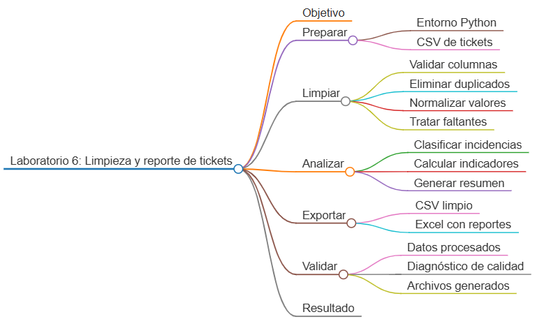
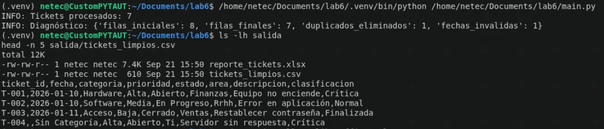

# Laboratorio 6: Limpieza y reporte de tickets de soporte

## Objetivo de la práctica:

Construir un pipeline con pandas que cargue tickets desde CSV, valide columnas, limpie valores faltantes y duplicados, normalice categorías, clasifique incidencias, calcule indicadores y exporte resultados a CSV y Excel con varias hojas.

## Objetivo Visual:



## Duración aproximada:

- 45 minutos.

## Instrucciones

### Tarea 1. **Preparación del entorno y datos**

Paso 1. En Ubuntu, abra **Visual Studio Code**, cree `laboratorio_6` y ábralo con **File -> Open Folder**.

Paso 2. Prepare el entorno:

```bash
sudo apt update
sudo apt install -y python3 python3-venv python3-pip
python3 -m venv .venv
source .venv/bin/activate
mkdir -p datos salida
touch main.py requirements.txt
```

Paso 3. Seleccione `.venv/bin/python` mediante `Python: Select Interpreter`.

Paso 4. Agregue las dependencias gratuitas a `requirements.txt`:

```text
pandas>=2.2,<3
openpyxl>=3.1,<4
```

Paso 5. Instálelas:

```bash
python -m pip install -r requirements.txt
```

Paso 6. Cree `datos/tickets.csv` y coloque los siguientes datos dentro:

```csv
ticket_id,fecha,categoria,prioridad,estado,area,descripcion
T-001,2026-01-10,Hardware,Alta,Abierto,Finanzas,Equipo no enciende
T-002,2026-01-10, software ,media,en progreso,RRHH,Error en aplicación
T-003,2026-01-11,Acceso,Baja,Cerrado,Ventas,Restablecer contraseña
T-004,fecha-invalida,,Alta,Abierto,TI,Servidor sin respuesta
T-005,2026-01-12,Red,,Abierto,Operaciones,Conexión intermitente
T-006,2026-01-12,Hardware,Media,,Finanzas,Teclado defectuoso
T-002,2026-01-10, software ,media,en progreso,RRHH,Error en aplicación
T-007,2026-01-13,SOFTWARE,urgente,Cerrado,TI,Actualización pendiente
```

### Tarea 2. **Carga y validación estructural**

Paso 7. Abra `main.py` y agregue:

```python
import logging
from pathlib import Path

import pandas as pd
from openpyxl.styles import Font, PatternFill


BASE_DIR = Path(__file__).resolve().parent
ENTRADA = BASE_DIR / "datos/tickets.csv"
SALIDA = BASE_DIR / "salida"
COLUMNAS_REQUERIDAS = {
    "ticket_id",
    "fecha",
    "categoria",
    "prioridad",
    "estado",
    "area",
    "descripcion",
}
logging.basicConfig(level=logging.INFO, format="%(levelname)s: %(message)s")
logger = logging.getLogger(__name__)
```

Paso 8. Agregue la carga del CSV:

```python
def cargar_tickets(ruta: Path) -> pd.DataFrame:
    if not ruta.is_file():
        raise FileNotFoundError(f"No se encontró el archivo: {ruta}")

    dataframe = pd.read_csv(ruta, encoding="utf-8")
    dataframe.columns = [columna.strip().lower() for columna in dataframe.columns]
    return dataframe
```

Paso 9. Agregue la validación de columnas:

```python
def validar_columnas(dataframe: pd.DataFrame) -> None:
    faltantes = COLUMNAS_REQUERIDAS - set(dataframe.columns)
    if faltantes:
        raise ValueError(f"Columnas obligatorias ausentes: {sorted(faltantes)}")
```

### Tarea 3. **Limpieza y clasificación**

Paso 10. Agregue una función para normalizar valores de texto:

```python
def normalizar_texto(serie: pd.Series) -> pd.Series:
    return serie.astype("string").str.strip().str.title()
```

Paso 11. Agregue el pipeline de limpieza:

```python
def limpiar_tickets(dataframe: pd.DataFrame) -> tuple[pd.DataFrame, dict]:
    df = dataframe.copy()
    filas_iniciales = len(df)
    duplicados = int(df.duplicated(subset=["ticket_id"]).sum())
    df = df.drop_duplicates(subset=["ticket_id"], keep="first")

    for columna in ["categoria", "prioridad", "estado", "area"]:
        df[columna] = normalizar_texto(df[columna])

    df["categoria"] = df["categoria"].fillna("Sin Categoría")
    df["prioridad"] = df["prioridad"].fillna("Media")
    df["estado"] = df["estado"].fillna("Sin Estado")
    df["area"] = df["area"].fillna("Sin Área")
    df["descripcion"] = df["descripcion"].fillna("Sin descripción")

    prioridades_validas = {"Baja", "Media", "Alta"}
    df.loc[~df["prioridad"].isin(prioridades_validas), "prioridad"] = "Media"

    df["fecha"] = pd.to_datetime(df["fecha"], errors="coerce")
    fechas_invalidas = int(df["fecha"].isna().sum())

    df["clasificacion"] = "Normal"
    df.loc[df["prioridad"].eq("Alta"), "clasificacion"] = "Crítica"
    df.loc[df["estado"].eq("Cerrado"), "clasificacion"] = "Finalizada"

    diagnostico = {
        "filas_iniciales": filas_iniciales,
        "filas_finales": len(df),
        "duplicados_eliminados": duplicados,
        "fechas_invalidas": fechas_invalidas,
    }
    return df, diagnostico
```

Paso 12. Observe que una fecha inválida se conserva como valor ausente para no inventar información. Este dato aparecerá en el diagnóstico.

### Tarea 4. **Cálculo de indicadores**

Paso 13. Agregue una función para crear un resumen vertical fácil de exportar:

```python
def generar_resumen(dataframe: pd.DataFrame) -> pd.DataFrame:
    bloques = []

    for dimension in ["categoria", "prioridad", "estado", "area", "clasificacion"]:
        conteo = (
            dataframe.groupby(dimension, dropna=False)
            .size()
            .reset_index(name="cantidad")
            .rename(columns={dimension: "valor"})
        )
        conteo.insert(0, "indicador", dimension)
        bloques.append(conteo)

    return pd.concat(bloques, ignore_index=True)
```

### Tarea 5. **Exportación a CSV y Excel**

Paso 14. Agregue la exportación con dos hojas:

```python
def exportar_resultados(
    tickets: pd.DataFrame,
    resumen: pd.DataFrame,
    diagnostico: dict,
) -> None:
    SALIDA.mkdir(parents=True, exist_ok=True)
    tickets.to_csv(SALIDA / "tickets_limpios.csv", index=False, encoding="utf-8")

    diagnostico_df = pd.DataFrame(
        [{"metrica": clave, "valor": valor} for clave, valor in diagnostico.items()]
    )
    ruta_excel = SALIDA / "reporte_tickets.xlsx"

    with pd.ExcelWriter(ruta_excel, engine="openpyxl") as writer:
        tickets.to_excel(writer, sheet_name="Tickets", index=False)
        resumen.to_excel(writer, sheet_name="Resumen", index=False)
        diagnostico_df.to_excel(writer, sheet_name="Calidad", index=False)

        for hoja in writer.book.worksheets:
            hoja.freeze_panes = "A2"
            hoja.auto_filter.ref = hoja.dimensions
            for celda in hoja[1]:
                celda.font = Font(bold=True, color="FFFFFF")
                celda.fill = PatternFill("solid", fgColor="1F4E78")

            for columna in hoja.columns:
                ancho = min(max(len(str(celda.value or "")) for celda in columna) + 2, 45)
                hoja.column_dimensions[columna[0].column_letter].width = ancho
```

### Tarea 6. **Ejecución principal**

Paso 15. Agregue:

```python
def main() -> int:
    try:
        tickets = cargar_tickets(ENTRADA)
        validar_columnas(tickets)
        tickets_limpios, diagnostico = limpiar_tickets(tickets)
        resumen = generar_resumen(tickets_limpios)
        exportar_resultados(tickets_limpios, resumen, diagnostico)
    except (OSError, ValueError, pd.errors.ParserError) as error:
        logger.error("No se pudo completar el reporte: %s", error)
        return 1

    logger.info("Tickets procesados: %d", len(tickets_limpios))
    logger.info("Diagnóstico: %s", diagnostico)
    return 0


if __name__ == "__main__":
    raise SystemExit(main())
```

### Tarea 7. **Ejecución y validaciones**

Paso 16. Ejecute el pipeline:

```bash
python main.py
```

Paso 17. Verifique los archivos generados:

```bash
ls -lh salida
head -n 5 salida/tickets_limpios.csv
```

### Resultado esperado


