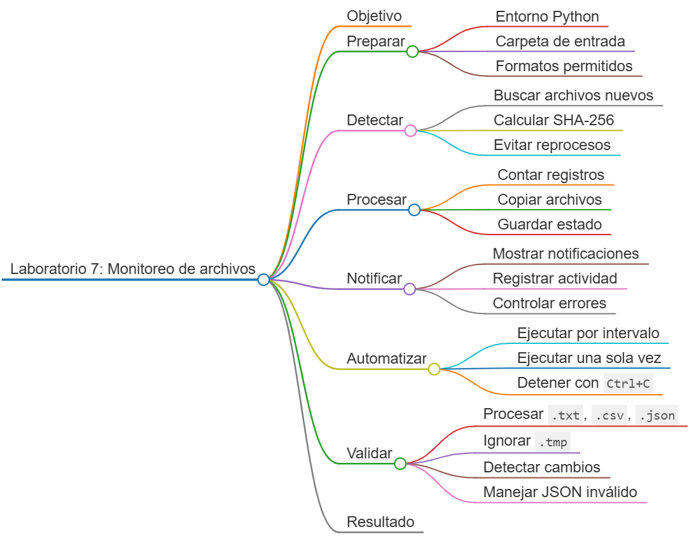
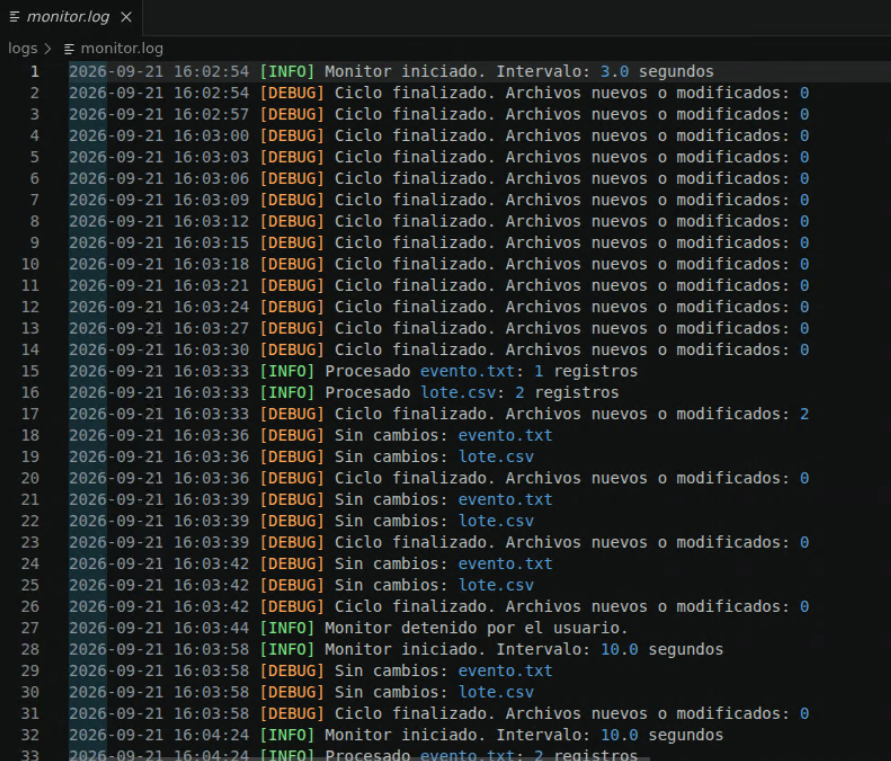

# Laboratorio 7: Monitoreo programado de archivos y notificaciones

## Objetivo de la práctica:

Desarrollar una automatización que revise periódicamente una carpeta, detecte archivos nuevos, procese solamente formatos permitidos, conserve un estado para evitar reprocesos, registre toda la actividad y emita una notificación de escritorio en Ubuntu.

## Objetivo Visual:



## Duración aproximada:

- 45 minutos.


## Instrucciones

### Tarea 1. **Preparación del entorno y proyecto**

Paso 1. En Ubuntu, abra **Visual Studio Code**, cree `laboratorio_7` y ábralo con **File -> Open Folder**.

Paso 2. Instale Python y la herramienta gratuita de notificaciones de escritorio:

```bash
sudo apt update
sudo apt install -y python3 python3-venv python3-pip libnotify-bin
```

Paso 3. Cree el entorno y la estructura:

```bash
python3 -m venv .venv
source .venv/bin/activate
mkdir -p entrada procesados logs
touch monitor.py requirements.txt
```

Paso 4. Seleccione `.venv/bin/python` en `Python: Select Interpreter`.

Paso 5. Este laboratorio utiliza únicamente la biblioteca estándar. Mantenga `requirements.txt` vacío.

### Tarea 2. **Configuración y estado persistente**

Paso 6. Abra `monitor.py` y agregue:

```python
import argparse
import csv
import hashlib
import json
import logging
import shutil
import subprocess
import time
from datetime import datetime
from pathlib import Path


BASE_DIR = Path(__file__).resolve().parent
ENTRADA = BASE_DIR / "entrada"
PROCESADOS = BASE_DIR / "procesados"
ESTADO = BASE_DIR / "estado.json"
EXTENSIONES = {".txt", ".csv", ".json"}
```

Paso 7. Configure el logger de consola y archivo:

```python
def configurar_logger() -> logging.Logger:
    logger = logging.getLogger("monitor")
    logger.setLevel(logging.DEBUG)

    if logger.handlers:
        return logger

    formato = logging.Formatter(
        "%(asctime)s [%(levelname)s] %(message)s",
        datefmt="%Y-%m-%d %H:%M:%S",
    )
    consola = logging.StreamHandler()
    consola.setLevel(logging.INFO)
    consola.setFormatter(formato)

    ruta_log = BASE_DIR / "logs/monitor.log"
    ruta_log.parent.mkdir(parents=True, exist_ok=True)
    archivo = logging.FileHandler(ruta_log, encoding="utf-8")
    archivo.setLevel(logging.DEBUG)
    archivo.setFormatter(formato)

    logger.addHandler(consola)
    logger.addHandler(archivo)
    return logger


logger = configurar_logger()
```

Paso 8. Agregue la lectura y escritura segura del estado:

```python
def cargar_estado() -> dict:
    if not ESTADO.exists():
        return {"procesados": {}}

    try:
        with ESTADO.open("r", encoding="utf-8") as archivo:
            estado = json.load(archivo)
    except (OSError, json.JSONDecodeError) as error:
        logger.warning("No se pudo leer el estado; se inicia vacío: %s", error)
        return {"procesados": {}}

    if not isinstance(estado, dict):
        return {"procesados": {}}
    return estado if isinstance(estado.get("procesados"), dict) else {"procesados": {}}


def guardar_estado(estado: dict) -> None:
    temporal = ESTADO.with_suffix(".tmp")
    with temporal.open("w", encoding="utf-8") as archivo:
        json.dump(estado, archivo, indent=2, ensure_ascii=False)
    temporal.replace(ESTADO)
```

### Tarea 3. **Detección y procesamiento**

Paso 9. Agregue una huella SHA-256 para identificar de forma única el contenido:

```python
def calcular_hash(ruta: Path) -> str:
    digest = hashlib.sha256()
    with ruta.open("rb") as archivo:
        while bloque := archivo.read(65_536):
            digest.update(bloque)
    return digest.hexdigest()
```

Paso 10. Agregue una función que cuente registros según el formato:

```python
def contar_registros(ruta: Path) -> int:
    if ruta.suffix.lower() == ".csv":
        with ruta.open("r", encoding="utf-8", newline="") as archivo:
            return sum(1 for _ in csv.DictReader(archivo))

    if ruta.suffix.lower() == ".json":
        with ruta.open("r", encoding="utf-8") as archivo:
            datos = json.load(archivo)
        return len(datos) if isinstance(datos, list) else 1

    with ruta.open("r", encoding="utf-8") as archivo:
        return sum(1 for linea in archivo if linea.strip())
```

Paso 11. Agregue la notificación. La ejecución usa una lista de argumentos y no usa `shell=True`:

```python
def notificar(titulo: str, mensaje: str) -> None:
    if not shutil.which("notify-send"):
        logger.warning("notify-send no está disponible: %s", mensaje)
        return

    try:
        subprocess.run(
            ["notify-send", titulo, mensaje],
            check=False,
            timeout=5,
        )
    except (OSError, subprocess.TimeoutExpired) as error:
        logger.warning("No fue posible mostrar la notificación: %s", error)
```

Paso 12. Agregue el procesamiento de un archivo:

```python
def procesar_archivo(ruta: Path, estado: dict) -> bool:
    try:
        huella = calcular_hash(ruta)
        clave = ruta.name

        if estado["procesados"].get(clave, {}).get("sha256") == huella:
            logger.debug("Sin cambios: %s", ruta.name)
            return False

        registros = contar_registros(ruta)
        marca = datetime.now().strftime("%Y%m%d_%H%M%S")
        destino = PROCESADOS / f"{marca}_{ruta.name}"
        PROCESADOS.mkdir(parents=True, exist_ok=True)
        shutil.copy2(ruta, destino)

        estado["procesados"][clave] = {
            "sha256": huella,
            "fecha": datetime.now().isoformat(timespec="seconds"),
            "registros": registros,
            "copia": destino.name,
        }
        guardar_estado(estado)
        logger.info("Procesado %s: %d registros", ruta.name, registros)
        notificar("Archivo procesado", f"{ruta.name}: {registros} registros")
        return True
    except (OSError, UnicodeError, csv.Error, json.JSONDecodeError) as error:
        logger.exception("Error al procesar %s: %s", ruta, error)
        notificar("Error de procesamiento", f"{ruta.name}: {error}")
        return False
```

Paso 13. Agregue la función de sondeo:

```python
def revisar_carpeta(estado: dict) -> int:
    ENTRADA.mkdir(parents=True, exist_ok=True)
    candidatos = sorted(
        ruta
        for ruta in ENTRADA.iterdir()
        if ruta.is_file() and ruta.suffix.lower() in EXTENSIONES
    )
    return sum(procesar_archivo(ruta, estado) for ruta in candidatos)
```

### Tarea 4. **Ejecución periódica y argumentos**

Paso 14. Agregue los argumentos:

```python
def crear_parser() -> argparse.ArgumentParser:
    parser = argparse.ArgumentParser(description="Monitor periódico de archivos.")
    parser.add_argument("--intervalo", type=float, default=10.0)
    parser.add_argument("--una-vez", action="store_true")
    return parser
```

Paso 15. Agregue el bucle principal con salida controlada mediante `Ctrl + C`:

```python
def main() -> int:
    argumentos = crear_parser().parse_args()
    if argumentos.intervalo <= 0:
        logger.error("El intervalo debe ser mayor que cero.")
        return 2

    estado = cargar_estado()
    logger.info("Monitor iniciado. Intervalo: %.1f segundos", argumentos.intervalo)

    try:
        while True:
            nuevos = revisar_carpeta(estado)
            logger.debug("Ciclo finalizado. Archivos nuevos o modificados: %d", nuevos)
            if argumentos.una_vez:
                break
            time.sleep(argumentos.intervalo)
    except KeyboardInterrupt:
        logger.info("Monitor detenido por el usuario.")

    return 0


if __name__ == "__main__":
    raise SystemExit(main())
```

### Tarea 5. **Ejecución y validaciones**

Paso 16. Inicie el monitor con un intervalo corto:

```bash
python monitor.py --intervalo 3
```

Paso 17. Sin cerrar el monitor, abra una segunda terminal de VS Code y cree los archivos de prueba:

```bash
printf 'Evento de mantenimiento completado\n' > entrada/evento.txt
printf 'id,valor\n1,125\n2,250\n' > entrada/lote.csv
printf 'Ignorar este archivo\n' > entrada/ignorar.tmp
```

Paso 18. Verifique que aparezcan dos notificaciones y que el archivo `.tmp` no sea procesado.

Paso 19. Detenga el monitor con `Ctrl + C` y revise las evidencias:

```bash
find procesados -type f -print
cat estado.json
cat logs/monitor.log
```

Paso 20. Ejecute un único ciclo. Como el contenido no cambió, no deben crearse copias nuevas:

```bash
python monitor.py --una-vez
```

Paso 21. Modifique el TXT y ejecute otro ciclo. La huella cambiará y se debe crear una nueva copia:

```bash
printf 'Segunda línea\n' >> entrada/evento.txt
python monitor.py --una-vez
```

Paso 22. Compruebe el manejo de JSON inválido:

```bash
printf '{json-invalido}\n' > entrada/error.json
python monitor.py --una-vez
```

Paso 23. Confirme que el error quede en el log y que los demás archivos puedan seguir procesándose.

Paso 24. Valide la sintaxis:

```bash
python -m py_compile monitor.py
```

### Resultado esperado

