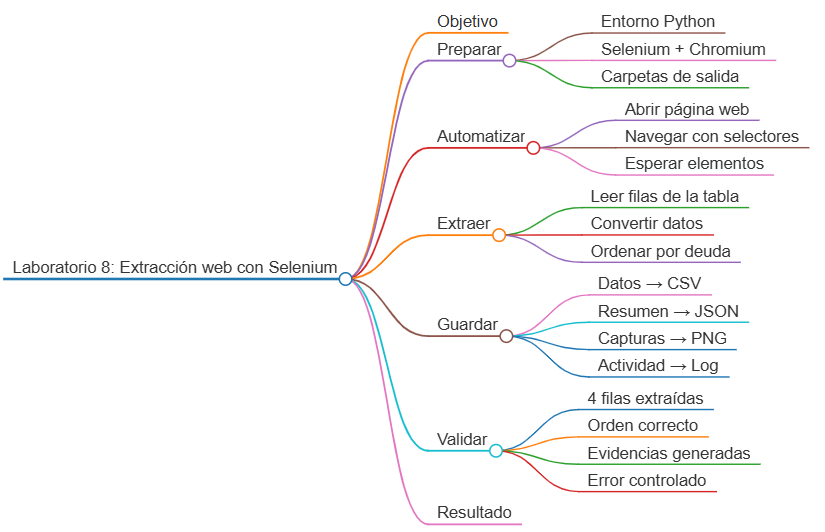
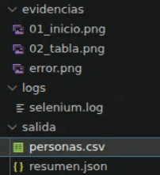

# Laboratorio 8: Extracción web y evidencias con Selenium

## Objetivo de la práctica:

Automatizar con Selenium la navegación en una página pública de demostración, localizar una tabla mediante selectores estables, extraer sus filas, ordenar resultados y guardar un CSV, un resumen JSON, capturas de pantalla y logs como evidencias de ejecución.

## Objetivo Visual:



## Duración aproximada:

- 50 minutos.

## Instrucciones

### Tarea 1. **Preparación del entorno y navegador**

Paso 1. En Ubuntu, abra **Visual Studio Code**, cree `laboratorio_8` y ábralo con **File -> Open Folder**.

Paso 2. Instale Python. Si Chromium no está instalado, instálelo con la opción disponible en su versión de Ubuntu:

```bash
sudo apt update
sudo apt install -y python3 python3-venv python3-pip chromium-browser
```

Paso 3. Si el paquete anterior no está disponible, utilice la distribución gratuita Snap:

```bash
sudo snap install chromium
```

Paso 4. Prepare el proyecto:

```bash
python3 -m venv .venv
source .venv/bin/activate
mkdir -p salida evidencias logs
touch automatizar_tabla.py requirements.txt
```

Paso 5. Seleccione `.venv/bin/python` desde `Python: Select Interpreter`.

Paso 6. Agregue la dependencia a `requirements.txt`:

```text
selenium>=4.25,<5
```

Paso 7. Instale y valide las herramientas:

```bash
python -m pip install -r requirements.txt
chromium --version || chromium-browser --version
```

Selenium Manager resolverá automáticamente el driver compatible. No se requiere comprar ni descargar un driver comercial.

### Tarea 2. **Configuración del navegador y logger**

Paso 8. Abra `automatizar_tabla.py` y agregue:

```python
import argparse
import csv
import json
import logging
import shutil
from datetime import datetime
from logging.handlers import RotatingFileHandler
from pathlib import Path

from selenium import webdriver
from selenium.common.exceptions import TimeoutException, WebDriverException
from selenium.webdriver.common.by import By
from selenium.webdriver.support import expected_conditions as EC
from selenium.webdriver.support.ui import WebDriverWait


BASE_DIR = Path(__file__).resolve().parent
URL = "https://the-internet.herokuapp.com/"
```

Paso 9. Configure el registro de actividad:

```python
def configurar_logger() -> logging.Logger:
    logger = logging.getLogger("selenium_lab")
    logger.setLevel(logging.DEBUG)
    if logger.handlers:
        return logger

    formato = logging.Formatter(
        "%(asctime)s [%(levelname)s] %(message)s",
        datefmt="%Y-%m-%d %H:%M:%S",
    )
    consola = logging.StreamHandler()
    consola.setLevel(logging.INFO)
    consola.setFormatter(formato)

    ruta_log = BASE_DIR / "logs/selenium.log"
    ruta_log.parent.mkdir(parents=True, exist_ok=True)
    archivo = RotatingFileHandler(
        ruta_log, maxBytes=1_000_000, backupCount=2, encoding="utf-8"
    )
    archivo.setLevel(logging.DEBUG)
    archivo.setFormatter(formato)

    logger.addHandler(consola)
    logger.addHandler(archivo)
    return logger


logger = configurar_logger()
```

Paso 10. Agregue la creación del driver. El modo headless permite ejecutar el laboratorio incluso sin mostrar la ventana:

```python
def crear_driver(mostrar: bool) -> webdriver.Chrome:
    ruta_chromium = (
        shutil.which("chromium")
        or shutil.which("chromium-browser")
        or shutil.which("google-chrome")
    )

    if not ruta_chromium:
        raise RuntimeError("No se encontró Chromium o Google Chrome.")

    opciones = webdriver.ChromeOptions()
    opciones.binary_location = ruta_chromium

    if not mostrar:
        opciones.add_argument("--headless=new")

    opciones.add_argument("--window-size=1440,1000")
    opciones.add_argument("--no-sandbox")
    opciones.add_argument("--disable-dev-shm-usage")

    # Perfil independiente para Selenium.
    # Especialmente útil cuando Chromium está instalado mediante Snap.
    perfil_selenium = Path.home() / "snap/chromium/common/selenium-profile"
    perfil_selenium.mkdir(parents=True, exist_ok=True)

    opciones.add_argument(f"--user-data-dir={perfil_selenium}")

    return webdriver.Chrome(options=opciones)
```

### Tarea 3. **Navegación y extracción de la tabla**

Paso 11. Agregue una función que navegue desde la página principal mediante el enlace visible:

```python
def abrir_tabla(driver: webdriver.Chrome) -> None:
    espera = WebDriverWait(driver, 15)
    driver.get(URL)
    espera.until(EC.title_contains("The Internet"))
    driver.save_screenshot(str(BASE_DIR / "evidencias/01_inicio.png"))

    enlace = espera.until(
        EC.element_to_be_clickable((By.LINK_TEXT, "Sortable Data Tables"))
    )
    enlace.click()
    espera.until(EC.visibility_of_element_located((By.ID, "table1")))
```

Paso 12. Agregue la extracción de las filas de `table1`:

```python
def extraer_personas(driver: webdriver.Chrome) -> list[dict]:
    filas = driver.find_elements(By.CSS_SELECTOR, "#table1 tbody tr")
    personas = []

    for fila in filas:
        celdas = fila.find_elements(By.TAG_NAME, "td")
        personas.append(
            {
                "apellido": celdas[0].text.strip(),
                "nombre": celdas[1].text.strip(),
                "correo": celdas[2].text.strip(),
                "deuda": float(celdas[3].text.replace("$", "").strip()),
                "sitio_web": celdas[4].text.strip(),
            }
        )

    return sorted(personas, key=lambda persona: persona["deuda"], reverse=True)
```

### Tarea 4. **Guardado de resultados y evidencias**

Paso 13. Agregue la exportación CSV:

```python
def guardar_csv(ruta: Path, personas: list[dict]) -> None:
    ruta.parent.mkdir(parents=True, exist_ok=True)
    campos = ["apellido", "nombre", "correo", "deuda", "sitio_web"]
    with ruta.open("w", encoding="utf-8", newline="") as archivo:
        escritor = csv.DictWriter(archivo, fieldnames=campos)
        escritor.writeheader()
        escritor.writerows(personas)
```

Paso 14. Agregue el resumen JSON:

```python
def guardar_resumen(ruta: Path, personas: list[dict]) -> None:
    resumen = {
        "fecha_ejecucion": datetime.now().isoformat(timespec="seconds"),
        "url": URL,
        "filas_extraidas": len(personas),
        "deuda_total": round(sum(persona["deuda"] for persona in personas), 2),
        "mayor_deuda": personas[0] if personas else None,
    }
    with ruta.open("w", encoding="utf-8") as archivo:
        json.dump(resumen, archivo, indent=2, ensure_ascii=False)
```

### Tarea 5. **Flujo principal y manejo de errores**

Paso 15. Agregue los argumentos:

```python
def crear_parser() -> argparse.ArgumentParser:
    parser = argparse.ArgumentParser(description="Extrae una tabla con Selenium.")
    parser.add_argument(
        "--visible",
        action="store_true",
        help="Muestra la ventana del navegador durante la ejecución.",
    )
    return parser
```

Paso 16. Agregue el flujo principal y garantice el cierre del navegador con `finally`:

```python
def main() -> int:
    argumentos = crear_parser().parse_args()
    (BASE_DIR / "evidencias").mkdir(parents=True, exist_ok=True)
    (BASE_DIR / "salida").mkdir(parents=True, exist_ok=True)
    driver = None

    try:
        driver = crear_driver(argumentos.visible)
        logger.info("Navegador iniciado")
        abrir_tabla(driver)
        personas = extraer_personas(driver)

        if not personas:
            raise ValueError("La tabla no contiene filas.")

        driver.save_screenshot(str(BASE_DIR / "evidencias/02_tabla.png"))
        guardar_csv(BASE_DIR / "salida/personas.csv", personas)
        guardar_resumen(BASE_DIR / "salida/resumen.json", personas)
        logger.info("Filas extraídas: %d", len(personas))
        return 0
    except (TimeoutException, WebDriverException, RuntimeError, ValueError) as error:
        logger.exception("La automatización falló: %s", error)
        if driver:
            driver.save_screenshot(str(BASE_DIR / "evidencias/error.png"))
        return 1
    finally:
        if driver:
            driver.quit()
            logger.info("Navegador cerrado")


if __name__ == "__main__":
    raise SystemExit(main())
```

### Tarea 6. **Ejecución y validaciones**

Paso 17. Ejecute primero en modo visible para observar la navegación:

```bash
python automatizar_tabla.py --visible
```


Paso 18. Revise los resultados:

```bash
cat salida/personas.csv
python -m json.tool salida/resumen.json
ls -lh evidencias logs
```

Paso 19. Confirme que el CSV contenga cuatro filas ordenadas por `deuda` de mayor a menor y que el resumen incluya la cantidad de filas, la deuda total y la persona con mayor deuda.

Paso 20. Abra `evidencias/01_inicio.png` y `evidencias/02_tabla.png` desde el explorador de VS Code y confirme que documenten ambos estados de la navegación.

Paso 21. Dentro de `automatizar_tabla`, en la funcion de `extraer_personas` cambie temporalmente el selector `#table1` por `#tabla-inexistente`, ejecute y compruebe que se genere `evidencias/error.png` y un traceback en `logs/selenium.log`. 


### Resultado esperado


