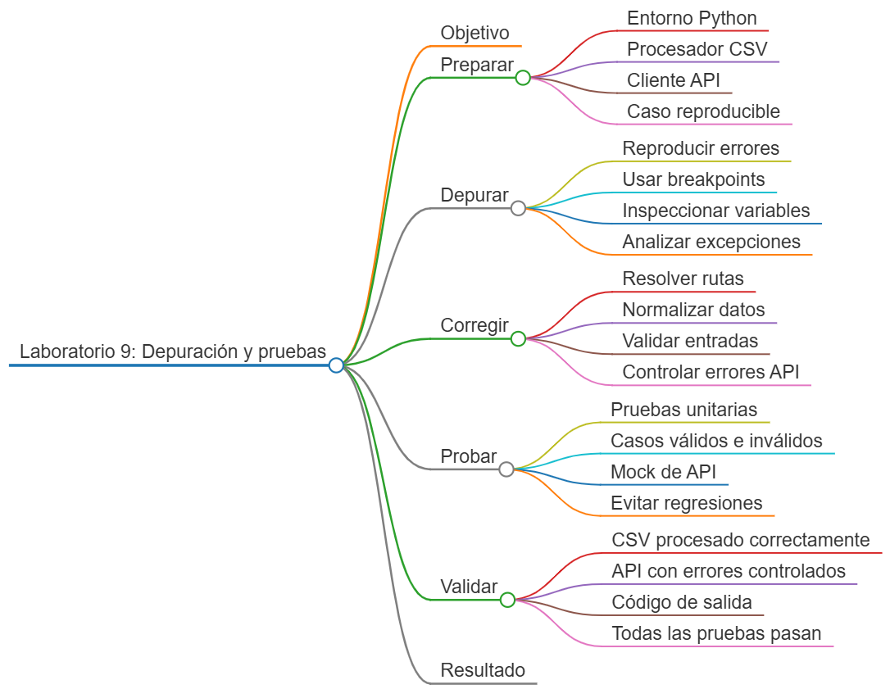
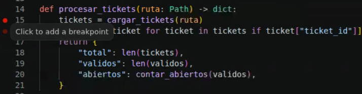
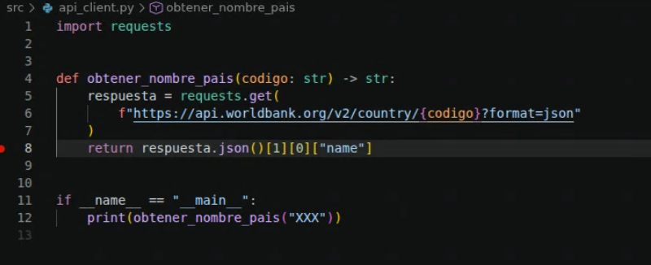
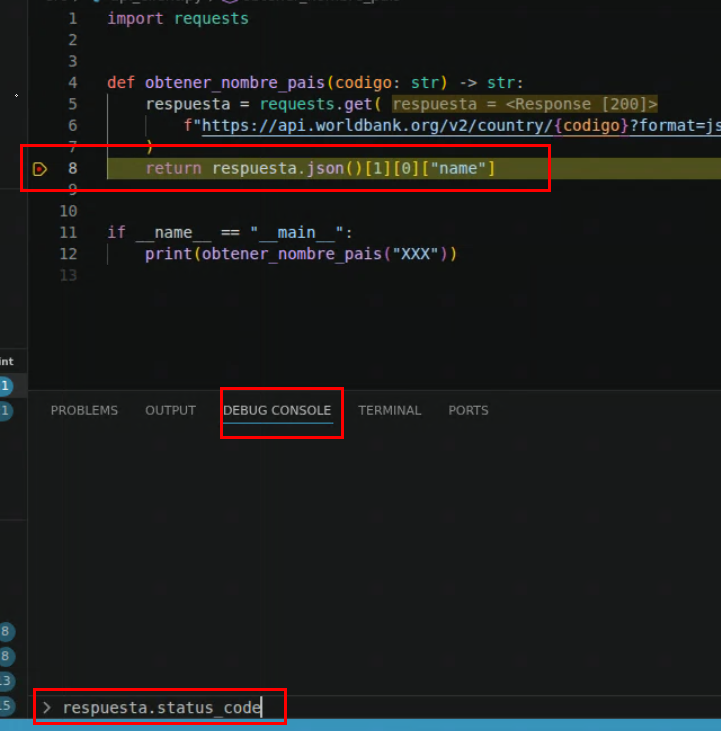
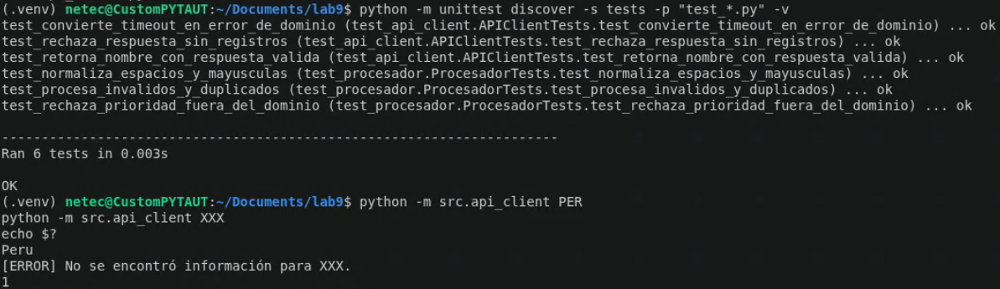

# Laboratorio 9: Depuración y pruebas de scripts de automatización

## Objetivo de la práctica:

Diagnosticar y corregir un procesador de CSV y un cliente de API que contienen errores de rutas, normalización, validación, excepciones y resultados; utilizar breakpoints de VS Code y crear pruebas unitarias deterministas para evitar regresiones.

## Objetivo Visual:



## Duración aproximada:

- 50 minutos.


## Instrucciones

### Tarea 1. **Preparación del entorno y caso reproducible**

Paso 1. En Ubuntu, abra **Visual Studio Code**, cree `laboratorio_9` y ábralo con **File -> Open Folder**.

Paso 2. Prepare el entorno y la estructura:

```bash
sudo apt update
sudo apt install -y python3 python3-venv python3-pip
python3 -m venv .venv
source .venv/bin/activate
mkdir -p datos src tests
touch src/__init__.py src/procesador.py src/api_client.py
touch tests/__init__.py requirements.txt
```

Paso 3. Seleccione `.venv/bin/python` desde `Python: Select Interpreter`.

Paso 4. Agregue a `requirements.txt`:

```text
requests>=2.31,<3
```

Paso 5. Instale la dependencia:

```bash
python -m pip install -r requirements.txt
```

Paso 6. Cree `datos/tickets.csv`:

```csv
ticket_id,estado,prioridad
T-001,Abierto,Alta
T-002,cerrado, media
,Abierto,Baja
T-004,ABIERTO,Urgente
T-001,Abierto,Alta
```

### Tarea 2. **Reproducción del defecto en el procesador CSV**

Paso 7. Copie el siguiente programa defectuoso en `src/procesador.py` sin corregirlo todavía:

```python
import csv
from pathlib import Path


def cargar_tickets(ruta: Path) -> list[dict]:
    with ruta.open("r") as archivo:
        return list(csv.DictReader(archivo))


def contar_abiertos(tickets: list[dict]) -> int:
    return sum(ticket["estado"] == "abierto" for ticket in tickets)


def procesar_tickets(ruta: Path) -> dict:
    tickets = cargar_tickets(ruta)
    validos = [ticket for ticket in tickets if ticket["ticket_id"]]
    return {
        "total": len(tickets),
        "validos": len(validos),
        "abiertos": contar_abiertos(validos),
    }


if __name__ == "__main__":
    print(procesar_tickets(Path("tickets.csv")))
```

Paso 8. Ejecute el script desde la raíz. Registre la primera evidencia: debe ocurrir `FileNotFoundError` porque la ruta no apunta a `datos/tickets.csv`.

```bash
python src/procesador.py
```

Paso 9. Cambie temporalmente la última línea por `Path("datos/tickets.csv")` y ejecute nuevamente. El programa funcionará, pero devolverá resultados incorrectos: no normaliza `Abierto`, acepta `Urgente` y no elimina duplicados.

### Tarea 3. **Depuración visual en VS Code**

Paso 10. Coloque un breakpoint en la línea `tickets = cargar_tickets(ruta)` haciendo clic en el margen izquierdo.



Paso 11. Coloque un segundo breakpoint dentro de `contar_abiertos()` y presione `F5`. Seleccione **Python Debugger: Current File** si VS Code lo solicita.

Paso 12. Use el panel **Variables** y la **Debug Console** para evaluar:

```python
ruta.resolve()
tickets[0]
[ticket["estado"] for ticket in tickets]
```

Paso 13. Utilice `F10` para avanzar, `F11` para entrar en funciones y `Shift + F11` para salir.


### Tarea 4. **Corrección del procesador CSV**

Paso 14. Reemplace `src/procesador.py` por la versión corregida:

```python
import argparse
import csv
from pathlib import Path


BASE_DIR = Path(__file__).resolve().parents[1]
ESTADOS = {"abierto", "cerrado", "en progreso"}
PRIORIDADES = {"baja", "media", "alta"}


def cargar_tickets(ruta: Path) -> list[dict]:
    if not ruta.is_file():
        raise FileNotFoundError(f"No se encontró el CSV: {ruta}")

    with ruta.open("r", encoding="utf-8", newline="") as archivo:
        return list(csv.DictReader(archivo))


def normalizar_ticket(ticket: dict) -> dict:
    return {
        "ticket_id": str(ticket.get("ticket_id", "")).strip().upper(),
        "estado": str(ticket.get("estado", "")).strip().lower(),
        "prioridad": str(ticket.get("prioridad", "")).strip().lower(),
    }


def validar_ticket(ticket: dict) -> bool:
    return bool(
        ticket["ticket_id"]
        and ticket["estado"] in ESTADOS
        and ticket["prioridad"] in PRIORIDADES
    )


def procesar_tickets(ruta: Path) -> dict:
    filas = cargar_tickets(ruta)
    unicos = {}
    invalidos = 0

    for fila in filas:
        ticket = normalizar_ticket(fila)
        if not validar_ticket(ticket):
            invalidos += 1
            continue
        unicos.setdefault(ticket["ticket_id"], ticket)

    tickets = list(unicos.values())
    return {
        "filas_leidas": len(filas),
        "tickets_validos": len(tickets),
        "duplicados": len(filas) - invalidos - len(tickets),
        "invalidos": invalidos,
        "abiertos": sum(ticket["estado"] == "abierto" for ticket in tickets),
    }


def main() -> int:
    parser = argparse.ArgumentParser(description="Procesa tickets desde un CSV.")
    parser.add_argument(
        "ruta",
        nargs="?",
        type=Path,
        default=BASE_DIR / "datos/tickets.csv",
    )
    argumentos = parser.parse_args()

    try:
        print(procesar_tickets(argumentos.ruta))
    except (OSError, csv.Error) as error:
        print(f"[ERROR] {error}")
        return 1
    return 0


if __name__ == "__main__":
    raise SystemExit(main())
```

Paso 15. Ejecute desde la raíz y después desde `src/`. Ambos comandos deben resolver correctamente la entrada predeterminada:

```bash
python src/procesador.py
cd src
python procesador.py
cd ..
```

Paso 16. Confirme el resultado: cinco filas leídas, dos tickets válidos, un duplicado, dos inválidos y un ticket abierto.

### Tarea 5. **Reproducción y corrección del cliente API**

Paso 17. Copie primero esta versión defectuosa en `src/api_client.py`:

```python
import requests


def obtener_nombre_pais(codigo: str) -> str:
    respuesta = requests.get(
        f"https://api.worldbank.org/v2/country/{codigo}?format=json"
    )
    return respuesta.json()[1][0]["name"]


if __name__ == "__main__":
    print(obtener_nombre_pais("XXX"))
```

Paso 18. Ejecútela y use un breakpoint en `respuesta.json()` para inspeccionar `respuesta.status_code`, `respuesta.headers` y el cuerpo. Identifique que no existe timeout, no se valida HTTP y se asume que siempre hay un registro.



```bash
python src/api_client.py
```


1. Abra la pestaña:

```text
DEBUG CONSOLE
```



No utilice la pestaña `TERMINAL`.

2. Evalúe, una por una, las siguientes expresiones:

```python
respuesta.status_code
```

```python
respuesta.headers
```

```python
respuesta.json()
```

```python
respuesta.text
```


3. Identifique los defectos del código actual:

* No define un `timeout`.
* No valida el código de estado HTTP.
* No verifica si la respuesta contiene JSON válido.
* Supone que siempre existe `respuesta.json()[1][0]`.
* No controla el caso en que el código de país no devuelve registros.


Paso 19. Reemplace el archivo por la implementación defensiva:

```python
import argparse

import requests


URL_BASE = "https://api.worldbank.org/v2/country"


class APIError(RuntimeError):
    """Representa un fallo controlado al consultar la API."""


def obtener_nombre_pais(
    sesion: requests.Session,
    codigo: str,
    timeout: float = 10.0,
) -> str:
    try:
        respuesta = sesion.get(
            f"{URL_BASE}/{codigo.strip().upper()}",
            params={"format": "json"},
            timeout=timeout,
        )
        respuesta.raise_for_status()
        contenido = respuesta.json()
    except requests.Timeout as error:
        raise APIError("La API excedió el tiempo de espera.") from error
    except requests.HTTPError as error:
        raise APIError(f"Error HTTP {error.response.status_code}.") from error
    except requests.exceptions.JSONDecodeError as error:
        raise APIError("La respuesta no contiene JSON válido.") from error
    except requests.RequestException as error:
        raise APIError(f"Error de red: {error}") from error

    if not isinstance(contenido, list) or len(contenido) < 2 or not contenido[1]:
        raise APIError(f"No se encontró información para {codigo}.")

    nombre = contenido[1][0].get("name")
    if not nombre:
        raise APIError("La respuesta no incluye el nombre del país.")
    return str(nombre)


def main() -> int:
    parser = argparse.ArgumentParser(description="Consulta el nombre de un país.")
    parser.add_argument("codigo")
    argumentos = parser.parse_args()

    try:
        with requests.Session() as sesion:
            print(obtener_nombre_pais(sesion, argumentos.codigo))
    except APIError as error:
        print(f"[ERROR] {error}")
        return 1
    return 0


if __name__ == "__main__":
    raise SystemExit(main())
```

### Tarea 6. **Pruebas unitarias del procesador**

Paso 20. Cree `tests/test_procesador.py`:

```python
import csv
import tempfile
import unittest
from pathlib import Path

from src.procesador import normalizar_ticket, procesar_tickets, validar_ticket


class ProcesadorTests(unittest.TestCase):
    def test_normaliza_espacios_y_mayusculas(self) -> None:
        ticket = normalizar_ticket(
            {"ticket_id": " t-10 ", "estado": " ABIERTO ", "prioridad": " Alta "}
        )
        self.assertEqual(
            ticket,
            {"ticket_id": "T-10", "estado": "abierto", "prioridad": "alta"},
        )

    def test_rechaza_prioridad_fuera_del_dominio(self) -> None:
        ticket = {"ticket_id": "T-10", "estado": "abierto", "prioridad": "urgente"}
        self.assertFalse(validar_ticket(ticket))

    def test_procesa_invalidos_y_duplicados(self) -> None:
        filas = [
            {"ticket_id": "T-1", "estado": "Abierto", "prioridad": "Alta"},
            {"ticket_id": "T-1", "estado": "Abierto", "prioridad": "Alta"},
            {"ticket_id": "", "estado": "Abierto", "prioridad": "Baja"},
        ]
        with tempfile.TemporaryDirectory() as temporal:
            ruta = Path(temporal) / "tickets.csv"
            with ruta.open("w", encoding="utf-8", newline="") as archivo:
                escritor = csv.DictWriter(
                    archivo, fieldnames=["ticket_id", "estado", "prioridad"]
                )
                escritor.writeheader()
                escritor.writerows(filas)

            resultado = procesar_tickets(ruta)

        self.assertEqual(resultado["tickets_validos"], 1)
        self.assertEqual(resultado["duplicados"], 1)
        self.assertEqual(resultado["invalidos"], 1)


if __name__ == "__main__":
    unittest.main()
```

### Tarea 7. **Pruebas unitarias del cliente API**

Paso 21. Cree `tests/test_api_client.py`:

```python
import unittest
from unittest.mock import Mock

import requests

from src.api_client import APIError, obtener_nombre_pais


class APIClientTests(unittest.TestCase):
    def test_retorna_nombre_con_respuesta_valida(self) -> None:
        respuesta = Mock()
        respuesta.raise_for_status.return_value = None
        respuesta.json.return_value = [{"total": 1}, [{"name": "Peru"}]]
        sesion = Mock()
        sesion.get.return_value = respuesta

        nombre = obtener_nombre_pais(sesion, "per", timeout=3)

        self.assertEqual(nombre, "Peru")
        sesion.get.assert_called_once_with(
            "https://api.worldbank.org/v2/country/PER",
            params={"format": "json"},
            timeout=3,
        )

    def test_convierte_timeout_en_error_de_dominio(self) -> None:
        sesion = Mock()
        sesion.get.side_effect = requests.Timeout("sin respuesta")

        with self.assertRaisesRegex(APIError, "tiempo de espera"):
            obtener_nombre_pais(sesion, "PER")

    def test_rechaza_respuesta_sin_registros(self) -> None:
        respuesta = Mock()
        respuesta.raise_for_status.return_value = None
        respuesta.json.return_value = [{"total": 0}, []]
        sesion = Mock()
        sesion.get.return_value = respuesta

        with self.assertRaisesRegex(APIError, "No se encontró"):
            obtener_nombre_pais(sesion, "XXX")


if __name__ == "__main__":
    unittest.main()
```

Paso 22. Ejecute todas las pruebas con descubrimiento automático:

```bash
python -m unittest discover -s tests -p "test_*.py" -v
```

Paso 23. Ejecute la validación manual de la API:

```bash
python -m src.api_client PER
python -m src.api_client XXX
echo $?
```

Paso 24. Confirme que `PER` muestre el nombre y que `XXX` produzca un error controlado con código `1`.


### Resultado esperado

