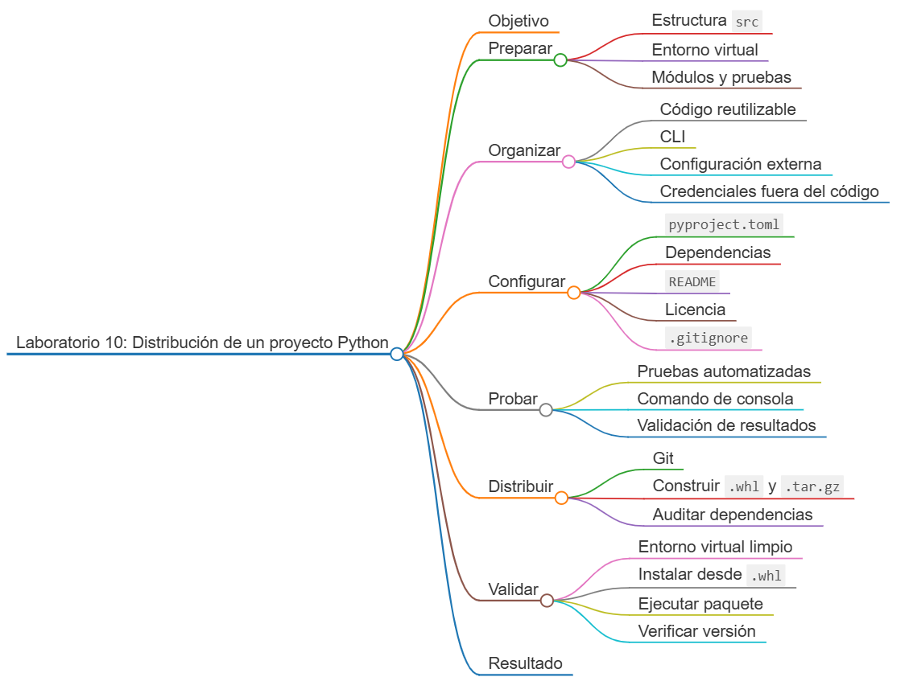
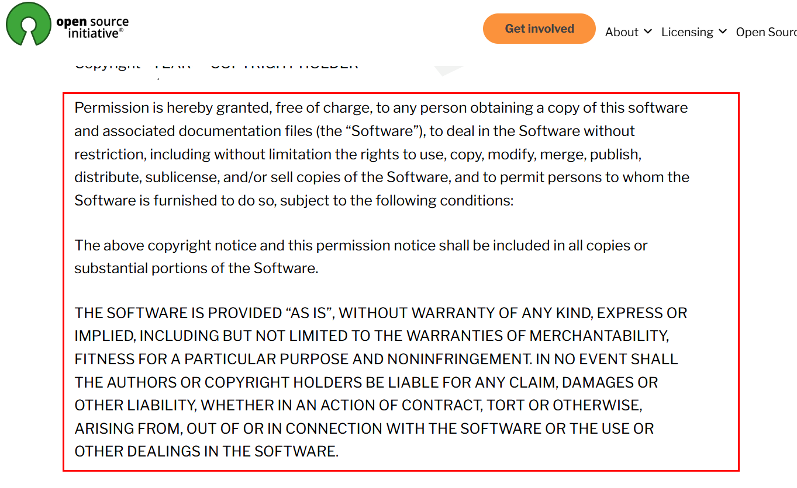
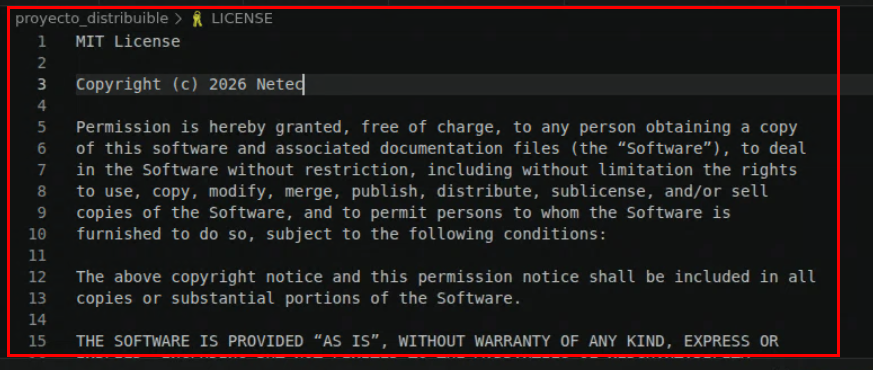
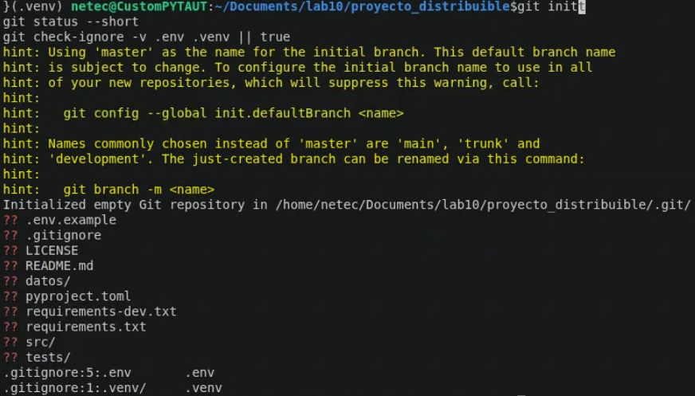
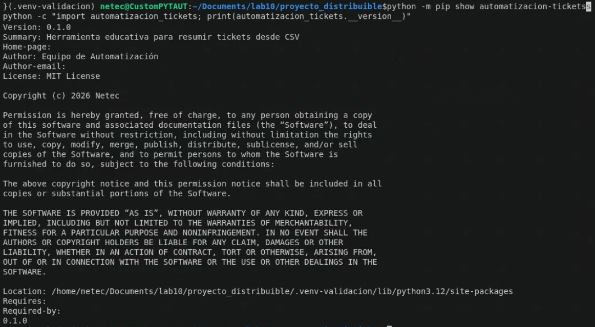

# Laboratorio 10: Preparación y distribución de un proyecto Python

## Objetivo de la práctica:

Transformar un script desarrollado previamente en un paquete instalable y reproducible: organizar módulos con estructura `src`, externalizar configuración y credenciales, documentar instalación y ejecución, definir dependencias, preparar Git, construir artefactos y verificar la instalación en un entorno virtual limpio.

## Objetivo Visual:



## Duración aproximada:

- 45 minutos.


## Instrucciones

### Tarea 1. **Preparación del entorno y estructura distribuible**

Paso 1. En Ubuntu, abra **Visual Studio Code**, cree `laboratorio_10` y ábralo con **File -> Open Folder**.

Paso 2. Instale las herramientas gratuitas necesarias:

```bash
sudo apt update
sudo apt install -y python3 python3-venv python3-pip git
python3 -m venv .venv
source .venv/bin/activate
```

Paso 3. Cree un proyecto independiente dentro del laboratorio para no sobrescribir este README de instrucciones:

```bash
mkdir -p proyecto_distribuible/src/automatizacion_tickets
mkdir -p proyecto_distribuible/tests proyecto_distribuible/datos
cd proyecto_distribuible
python3 -m venv .venv
source .venv/bin/activate
touch src/automatizacion_tickets/__init__.py
touch src/automatizacion_tickets/core.py src/automatizacion_tickets/cli.py
touch tests/test_core.py pyproject.toml README.md LICENSE
touch requirements.txt requirements-dev.txt .gitignore .env.example
```

Paso 4. Seleccione `proyecto_distribuible/.venv/bin/python` desde `Python: Select Interpreter`.

Paso 5. Verifique la estructura esperada:

```text
proyecto_distribuible/
├── src/automatizacion_tickets/
│   ├── __init__.py
│   ├── cli.py
│   └── core.py
├── tests/test_core.py
├── datos/tickets.csv
├── .env.example
├── .gitignore
├── LICENSE
├── pyproject.toml
├── README.md
├── requirements.txt
└── requirements-dev.txt
```

### Tarea 2. **Organización del código como paquete**

Paso 6. Abra `src/automatizacion_tickets/core.py` y agregue funciones documentadas:

```python
"""Funciones centrales para resumir tickets almacenados en CSV."""

import csv
from collections import Counter
from pathlib import Path


ESTADOS_VALIDOS = {"abierto", "cerrado", "en progreso"}


def cargar_tickets(ruta: Path) -> list[dict]:
    """Carga y valida tickets desde un archivo CSV.

    Args:
        ruta: Archivo CSV con las columnas ticket_id, estado y prioridad.

    Returns:
        Lista de tickets normalizados.

    Raises:
        FileNotFoundError: Si el archivo no existe.
        ValueError: Si faltan columnas o un estado no es válido.
    """
    if not ruta.is_file():
        raise FileNotFoundError(f"No se encontró el archivo: {ruta}")

    with ruta.open("r", encoding="utf-8", newline="") as archivo:
        lector = csv.DictReader(archivo)
        requeridas = {"ticket_id", "estado", "prioridad"}
        if not lector.fieldnames or not requeridas.issubset(lector.fieldnames):
            raise ValueError(f"El CSV debe incluir: {sorted(requeridas)}")

        tickets = []
        for numero, fila in enumerate(lector, start=2):
            ticket = {
                "ticket_id": fila["ticket_id"].strip().upper(),
                "estado": fila["estado"].strip().lower(),
                "prioridad": fila["prioridad"].strip().lower(),
            }
            if not ticket["ticket_id"]:
                raise ValueError(f"ticket_id vacío en la fila {numero}")
            if ticket["estado"] not in ESTADOS_VALIDOS:
                raise ValueError(f"Estado inválido en la fila {numero}")
            tickets.append(ticket)

    return tickets


def resumir_estados(tickets: list[dict]) -> dict[str, int]:
    """Cuenta tickets por estado y retorna un diccionario ordenado."""
    conteo = Counter(ticket["estado"] for ticket in tickets)
    return dict(sorted(conteo.items()))
```

Paso 7. Abra `src/automatizacion_tickets/cli.py` y agregue el comando de consola:

```python
"""Interfaz de línea de comandos del paquete."""

import argparse
import json
import logging
import os
from pathlib import Path

from .core import cargar_tickets, resumir_estados


def crear_parser() -> argparse.ArgumentParser:
    parser = argparse.ArgumentParser(description="Resume tickets desde un CSV.")
    parser.add_argument("entrada", type=Path)
    parser.add_argument("--salida", type=Path, default=Path("resumen.json"))
    return parser


def main() -> int:
    nivel = os.getenv("AUTOMATIZACION_LOG_LEVEL", "INFO").upper()
    logging.basicConfig(level=nivel, format="%(levelname)s: %(message)s")
    logger = logging.getLogger(__name__)
    argumentos = crear_parser().parse_args()

    try:
        tickets = cargar_tickets(argumentos.entrada)
        resumen = resumir_estados(tickets)
        argumentos.salida.parent.mkdir(parents=True, exist_ok=True)
        argumentos.salida.write_text(
            json.dumps(resumen, indent=2, ensure_ascii=False),
            encoding="utf-8",
        )
    except (OSError, ValueError) as error:
        logger.error("No se pudo completar el proceso: %s", error)
        return 1

    logger.info("Tickets procesados: %d", len(tickets))
    logger.info("Resultado: %s", argumentos.salida)
    return 0


if __name__ == "__main__":
    raise SystemExit(main())
```

Paso 8. Abra `src/automatizacion_tickets/__init__.py`:

```python
"""Automatización y resumen de tickets."""

from .core import cargar_tickets, resumir_estados


__all__ = ["cargar_tickets", "resumir_estados"]
__version__ = "0.1.0"
```

Paso 9. Cree `datos/tickets.csv`:

```csv
ticket_id,estado,prioridad
T-001,Abierto,Alta
T-002,Cerrado,Media
T-003,En progreso,Baja
```

### Tarea 3. **Metadatos y dependencias**

Paso 10. Abra `pyproject.toml`:

```toml
[build-system]
requires = ["setuptools>=68", "wheel"]
build-backend = "setuptools.build_meta"

[project]
name = "automatizacion-tickets"
version = "0.1.0"
description = "Herramienta educativa para resumir tickets desde CSV"
readme = "README.md"
requires-python = ">=3.10"
license = { file = "LICENSE" }
authors = [{ name = "Equipo de Automatización" }]
dependencies = []

[project.scripts]
automatizar-tickets = "automatizacion_tickets.cli:main"

[project.optional-dependencies]
dev = [
  "build>=1.2,<2",
  "pip-audit>=2.7,<3",
]

[tool.setuptools.packages.find]
where = ["src"]

[tool.setuptools.package-dir]
"" = "src"
```

Paso 11. `requirements.txt` debe quedar vacío porque el paquete no tiene dependencias de ejecución externas. Abra `requirements-dev.txt` y agregue:

```text
-e .[dev]
```

Paso 12. Instale el proyecto en modo editable junto con las herramientas de desarrollo:

```bash
python3 -m pip install -r requirements-dev.txt
```

### Tarea 4. **Documentación y licencia**

Paso 13. Abra el `README.md` interno de `proyecto_distribuible`:

````markdown
# Automatización de tickets

Herramienta de línea de comandos que valida un CSV y resume tickets por estado.

## Requisitos

- Python 3.10 o superior.
- Ubuntu, macOS o Windows.

## Instalación

```bash
python3 -m venv .venv
source .venv/bin/activate
python -m pip install dist/automatizacion_tickets-0.1.0-py3-none-any.whl
```

## Uso

```bash
automatizar-tickets datos/tickets.csv --salida salida/resumen.json
```

## Formato de entrada

CSV UTF-8 con las columnas `ticket_id`, `estado` y `prioridad`.

## Configuración

La variable opcional `AUTOMATIZACION_LOG_LEVEL` acepta `DEBUG`, `INFO`, `WARNING` o `ERROR`.
````

Paso 14. En `LICENSE`, agregue la licencia permisiva MIT, gratuita y de código abierto. Puede obtener el texto oficial desde `https://opensource.org/license/mit` y sustituir el año y titular.





### Tarea 5. **Configuración y credenciales fuera del código**

Paso 15. Abra `.env.example` y documente únicamente valores ficticios:

```text
AUTOMATIZACION_LOG_LEVEL=INFO
API_TOKEN=reemplazar
```

Paso 16. Abra `.gitignore`:

```text
.venv/
.venv-validacion/
__pycache__/
*.pyc
.env
dist/
build/
*.egg-info/
.pytest_cache/
salida/
```

Paso 17. Co el siguiente comando cree un `.env` local y verifique que nunca se incluya en Git:

```bash
cp .env.example .env
```

No cargue automáticamente `API_TOKEN` porque el proyecto no lo necesita. El ejemplo documenta cómo separar un secreto si una versión futura consume una API.

### Tarea 6. **Pruebas automatizadas**

Paso 18. Cree `tests/test_core.py`:

```python
import csv
import tempfile
import unittest
from pathlib import Path

from automatizacion_tickets import cargar_tickets, resumir_estados


class CoreTests(unittest.TestCase):
    def test_carga_y_resume_estados(self) -> None:
        with tempfile.TemporaryDirectory() as temporal:
            ruta = Path(temporal) / "tickets.csv"
            with ruta.open("w", encoding="utf-8", newline="") as archivo:
                escritor = csv.DictWriter(
                    archivo, fieldnames=["ticket_id", "estado", "prioridad"]
                )
                escritor.writeheader()
                escritor.writerows(
                    [
                        {"ticket_id": "T-1", "estado": "Abierto", "prioridad": "Alta"},
                        {"ticket_id": "T-2", "estado": "Cerrado", "prioridad": "Baja"},
                    ]
                )

            tickets = cargar_tickets(ruta)

        self.assertEqual(resumir_estados(tickets), {"abierto": 1, "cerrado": 1})

    def test_rechaza_columnas_incompletas(self) -> None:
        with tempfile.TemporaryDirectory() as temporal:
            ruta = Path(temporal) / "tickets.csv"
            ruta.write_text("ticket_id,estado\nT-1,Abierto\n", encoding="utf-8")

            with self.assertRaisesRegex(ValueError, "debe incluir"):
                cargar_tickets(ruta)


if __name__ == "__main__":
    unittest.main()
```

Paso 19. Ejecute las pruebas y el comando instalado en modo editable:

```bash
python -m unittest discover -s tests -p "test_*.py" -v
automatizar-tickets datos/tickets.csv --salida salida/resumen.json
cat salida/resumen.json
```

### Tarea 7. **Inicialización del repositorio Git**

Paso 20. Inicialice el repositorio y revise cuidadosamente qué archivos serán versionados:

```bash
git init
git status --short
git check-ignore -v .env .venv || true
```



Paso 21. Confirme que `.env` y `.venv` estén ignorados. Luego cree el primer commit:

```bash
git add .
git commit -m "Preparar paquete distribuible de automatización"
git log --oneline -1
```

Si Git solicita identidad, configure su nombre y correo corporativo con `git config --local user.name` y `git config --local user.email` antes de repetir el commit.

### Tarea 8. **Construcción y auditoría local**

Paso 22. Ejecute las pruebas antes de construir:

```bash
python -m unittest discover -s tests -v
```

Paso 23. Construya los artefactos:

```bash
python -m build
ls -lh dist
```

Paso 24. Verifique que se hayan generado un archivo `.whl` y un archivo `.tar.gz`.

Paso 25. Audite las dependencias instaladas:

```bash
python -m pip_audit
```

La auditoría puede reportar herramientas del entorno; no modifique versiones sin probar nuevamente el proyecto.

### Tarea 9. **Instalación en un entorno virtual limpio**

Paso 26. Cree un segundo entorno sin heredar la instalación editable:

```bash
deactivate
python3 -m venv .venv-validacion
source .venv-validacion/bin/activate
python -m pip install dist/*.whl
```

Paso 27. Ejecute el comando instalado desde el wheel:

```bash
automatizar-tickets datos/tickets.csv --salida salida/validacion.json
cat salida/validacion.json
```

Paso 28. Compruebe los metadatos y la importación:

```bash
python -m pip show automatizacion-tickets
python -c "import automatizacion_tickets; print(automatizacion_tickets.__version__)"
```

Paso 29. Confirme que la versión sea `0.1.0`, que el comando procese tres tickets y que el JSON contenga un registro por cada estado.

### Resultado esperado


